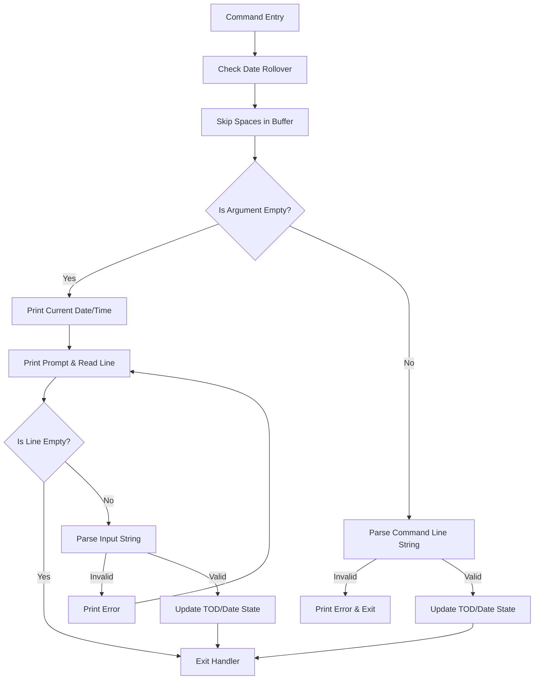

# Plan: DATE / TIME Built-in Commands (Phase 1)

This plan details the implementation of Phase 1 for the built-in `DATE` and `TIME` commands. This phase focuses on a self-contained, CIA-TOD-backed clock system with no external hardware-RTC dependencies, setting the foundations for subsequent RTC phases.

## User Review Required

> [!IMPORTANT]
> **Zero-Page & Workspace Safety:** We will operate entirely within the existing Zero-Page scratch register budget (`TempLo`/`TempHi` at `$64`/$65, `PrintPtrLo`/`PrintPtrHi` at `$FB`/$FC) to avoid adding new ZP locations. The interactive sub-prompt will reuse the 80-byte `CommandBuffer` at `$033C` to read input lines, which is safe since the original command parsing is complete by then.
>
> **Boot-Time Auto-Detection:** The CIA #1 TOD input frequency (50Hz vs 60Hz) will be auto-detected at boot time by querying the KERNAL's video standard flag at `$02A6` (0 = NTSC, 1 = PAL).

## Open Questions

None at this time. All design parameters (24-hour clock, default epoch 1980-01-01, lazy midnight rollover, etc.) are locked in based on the master plan.

---

## Detailed Memory Layout

We extend the `VmmData` segment (defined at `$1FA0` in `src/command64/vmm.asm`) to reclaim the remaining 4 bytes of the page up to the `$2000` (`AppTable`) boundary:

| Symbol | Address | Size | Description |
|---|---|---|---|
| `vmmInitialized` | `$1FA0` | 1 byte | VMM Initialization flag |
| `vmmTempByte` | `$1FA1` | 1 byte | VMM temporary scratch |
| `fileScratch` | `$1FA2` | 90 bytes | File naming scratch area (up to `$1FFB`) |
| `SysDateYear` | `$1FFC` | 1 byte | Offset from 1980 (e.g., 46 = 2026). Range: 0 to 255. |
| `SysDateMonth` | `$1FFD` | 1 byte | Month index. Range: 1 to 12. |
| `SysDateDay` | `$1FFE` | 1 byte | Day of month. Range: 1 to 31. |
| `SysDateLastHour` | `$1FFF` | 1 byte | Last-seen 24-hour decimal value (0 to 23). Used for lazy rollover detection. |

---

## Subroutines Design

We will add the following subroutines to `src/command64/utils.asm` (or a dedicated clock assembly block):

### 1. `clockInit`
- **Purpose:** Initializes the CIA #1 TOD clock standard at system boot.
- **Logic:**
  1. Read KERNAL video standard flag at `$02A6`.
  2. Read Control Register A of CIA 1 (`$DC0E`).
  3. If `$02A6` == 0 (NTSC), clear bit 7 of `$DC0E`. If `$02A6` == 1 (PAL), set bit 7. Write back to `$DC0E`.
  4. Read Control Register B of CIA 1 (`$DC0F`) and clear bit 7 (ensures TOD alarm mode is disabled, enabling clock access).
  5. Initialize date variables: `SysDateYear = 0`, `SysDateMonth = 1`, `SysDateDay = 1`, `SysDateLastHour = 0`.
  6. Write default time `00:00:00` to CIA 1 TOD using `writeTimeToCIA` with `A=0`, `X=0`, `Y=0`.
- **Registers Clobbered:** `A`, `X`

### 2. `readTimeFromCIA`
- **Purpose:** Reads time from CIA #1 registers, unlatches them, and converts it to 24-hour decimal.
- **Register Interface:**
  - **Inputs:** None.
  - **Outputs:**
    - `A` = Hour (0-23 decimal)
    - `X` = Minute (0-59 decimal)
    - `Y` = Second (0-59 decimal)
- **Execution Steps:**
  1. Clear bit 7 of `$DC0F` to ensure TOD clock registers are active (not alarm).
  2. Read `$DC0B` (Hours) and store in `TempLo`. (This freezes/latches internal registers).
  3. Read `$DC0A` (Minutes) and store in `PrintPtrLo`.
  4. Read `$DC09` (Seconds) and store in `PrintPtrHi`.
  5. Read `$DC08` (Tenths) to unlatch registers; discard Tenths value.
  6. Convert Minutes (`PrintPtrLo`) and Seconds (`PrintPtrHi`) from BCD to decimal using `bcdToDec`.
  7. Decode BCD Hour in `TempLo` (bit 7 = PM, bit 4 = Tens of Hours BCD, bits 3-0 = Units of Hours BCD) to 24-hour decimal:
     - `bcdHour = TempLo & $1F`
     - `decHour = bcdToDec(bcdHour)`
     - If `decHour == 12`:
       - If PM (bit 7 of `TempLo` == 1), Hour = 12.
       - If AM (bit 7 of `TempLo` == 0), Hour = 0.
     - Else:
       - If PM, Hour = `decHour + 12`.
       - If AM, Hour = `decHour`.

### 3. `writeTimeToCIA`
- **Purpose:** Converts 24-hour decimal time to 12-hour BCD + AM/PM format and writes it to CIA #1 registers.
- **Register Interface:**
  - **Inputs:**
    - `A` = Hour (0-23 decimal)
    - `X` = Minute (0-59 decimal)
    - `Y` = Second (0-59 decimal)
- **Execution Steps:**
  1. Store inputs in temporary scratch: Hour in `TempLo`, Minute in `TempHi`, Second in `PrintPtrLo`.
  2. Clear bit 7 of `$DC0F`.
  3. Convert Hour (`TempLo`) from 24-hour decimal to 12-hour BCD + AM/PM bit 7:
     - If Hour == 0 (Midnight): set target hour BCD register to `$12` (AM).
     - If Hour == 12 (Noon): set target hour BCD register to `$92` (PM).
     - If Hour >= 13: subtract 12, convert to BCD, set bit 7 (PM).
     - If Hour is 1-11: convert to BCD (AM).
     - Store resulting BCD value in `PrintPtrHi`.
  4. Convert Minute (`TempHi`) and Second (`PrintPtrLo`) to BCD using `decToBcd`.
  5. Write BCD values to CIA TOD:
     - Write Hour (`PrintPtrHi`) to `$DC0B` (Stops clock).
     - Write Minute (`TempHi`) to `$DC0A`.
     - Write Second (`PrintPtrLo`) to `$DC09`.
     - Write 0 to `$DC08` (Tenths register, restarts clock at top of 0th tenth).

### 4. `bcdToDec`
- **Purpose:** Converts a BCD byte to decimal.
- **Logic:** `Decimal = (BCD & $F0) >> 4 * 10 + (BCD & $0F)`.
- **Implementation:**
  ```kickass
  bcdToDec:
      tay                     // Y = BCD value
      and #$F0                // A = tens * 16
      lsr                     // A = tens * 8
      sta TempLo
      lsr
      lsr                     // A = tens * 2
      clc
      adc TempLo              // A = tens * 10
      sta TempLo
      tya
      and #$0F                // A = units
      clc
      adc TempLo
      rts
  ```

### 5. `decToBcd`
- **Purpose:** Converts a decimal byte (0-99) to BCD.
- **Logic:** Subtract 10 repeatedly to determine tens digit and units remainder.
- **Implementation:**
  ```kickass
  decToBcd:
      ldx #0
  -   cmp #10
      bcc +
      sbc #10                 // Carry is set, so SBC does subtraction directly
      inx
      jmp -
  +   sta TempLo
      txa
      asl
      asl
      asl
      asl
      ora TempLo
      rts
  ```

### 6. `isLeapYear`
- **Purpose:** Determines if a year offset is a leap year.
- **Formula:** A year offset from 1980 is a leap year if `(offset & 3) == 0`, unless `offset == 120` (2100) or `offset == 220` (2200).
- **Implementation:**
  ```kickass
  isLeapYear:
      tay
      and #3
      bne isNotLeap
      cpy #120
      beq isNotLeap
      cpy #220
      beq isNotLeap
      sec                     // Carry=1 -> Leap year
      rts
  isNotLeap:
      clc                     // Carry=0 -> Normal year
      rts
  ```

### 7. `getDaysInMonth`
- **Purpose:** Returns the maximum number of days in a month.
- **Inputs:** `A` = Month (1-12), `X` = Year offset (0-255).
- **Outputs:** `A` = max days.
- **Logic:** Query month lookup table. If February (Month = 2), perform leap year check.

### 8. `checkDateRollover`
- **Purpose:** Automatically increments date if a midnight hour-wrap has occurred.
- **Execution Steps:**
  1. Call `readTimeFromCIA` (returns Hour in `A`).
  2. Compare `A` against `SysDateLastHour`.
  3. If `A < SysDateLastHour`, a midnight wrap occurred:
     - Call `incrementDate` to advance `SysDateDay`, `SysDateMonth`, and `SysDateYear`.
  4. Write `A` to `SysDateLastHour`.

### 9. `incrementDate`
- **Purpose:** Increments current date with carry processing for month and leap-year.
- **Logic:** `SysDateDay = SysDateDay + 1`. If `SysDateDay > getDaysInMonth(SysDateMonth, SysDateYear)`, then `SysDateDay = 1`, `SysDateMonth = SysDateMonth + 1`. If `SysDateMonth > 12`, then `SysDateMonth = 1`, `SysDateYear = SysDateYear + 1`.

---

## Input Parsing Subroutines

### 1. `parseNum2`
- **Purpose:** Parses a 2-digit decimal number.
- **Inputs:** `Y` = current parse position in `CommandBuffer`.
- **Outputs:** `A` = numeric value (0-99), `Y` advanced by 2. `C` = 0 on success, `C` = 1 on invalid characters.

### 2. `parseNum4`
- **Purpose:** Parses a 4-digit decimal number.
- **Inputs:** `Y` = current parse position in `CommandBuffer`.
- **Outputs:** `HexValLo`/`HexValHi` = numeric value (0-9999), `Y` advanced by 4. `C` = 0 on success.
- **Logic:** Parses two 2-digit pairs, multiplies the first pair by 100, and adds the second pair.

### 3. `parseDateArg`
- **Purpose:** Parses a date string matching `YYYY-MM-DD`.
- **Inputs:** `ParsePos` in zero-page.
- **Outputs:** `X` = year offset (0-255), `TempLo` = month (1-12), `TempHi` = day. `C` = 0 on success.
- **Logic:**
  1. Call `parseNum4` to get year. Subtract 1980. Verify that it lies within `0` and `255`. Save offset.
  2. Verify separator `-`.
  3. Call `parseNum2` to get month. Verify month is `1` to `12`.
  4. Verify separator `-`.
  5. Call `parseNum2` to get day. Verify day is `1` to `getDaysInMonth(month, yearOffset)`.
  6. Check that only spaces follow.

### 4. `parseTimeArg`
- **Purpose:** Parses a time string matching `HH:MM:SS`.
- **Inputs:** `ParsePos` in zero-page.
- **Outputs:** `X` = Hour (0-23), `TempLo` = Minute (0-59), `TempHi` = Second (0-59). `C` = 0 on success.
- **Logic:**
  1. Call `parseNum2` to get Hour. Verify Hour < 24.
  2. Verify separator `:`.
  3. Call `parseNum2` to get Minute. Verify Minute < 60.
  4. Verify separator `:`.
  5. Call `parseNum2` to get Second. Verify Second < 60.
  6. Check that only spaces follow.

---

## Output Print Subroutines

### 1. `printDec2`
- **Purpose:** Prints a 1-byte value in decimal, ensuring a minimum width of 2 by prefixing with a leading zero if necessary.
- **Input:** `A` = value (0-99).

### 2. `printCurrentDate`
- **Purpose:** Prints the current date matching the format `YYYY-MM-DD`.
- **Logic:** Prints `SysDateYear + 1980` using `printDecimal16`, prints `-`, prints `SysDateMonth` using `printDec2`, prints `-`, prints `SysDateDay` using `printDec2`.

### 3. `printCurrentTime`
- **Purpose:** Prints the current time matching the format `HH:MM:SS`.
- **Logic:** Calls `readTimeFromCIA` and prints each component using `printDec2` separated by `:`.

---

## Shell Commands Flow (cmdDate / cmdTime)



---

## Proposed Changes

### Core OS Kernel and Shell

---

#### [MODIFY] [shell.asm](../../src/command64/shell.asm)
- Add `date  ` and `time  ` command definitions to `tableCmd`.
- Implement `cmdDate` and `cmdTime` dispatch and handler routines.
- Implement the interactive sub-prompt loops for both commands when called without arguments. If input is invalid, display an error message and re-prompt; if empty (RETURN only), exit without change.
- Modify the shell boot sequence (`start`) to call `jsr clockInit`.
- Place command-related strings in the `ShellExt` segment.

#### [MODIFY] [vmm.asm](../../src/command64/vmm.asm)
- Append the 4-byte date-state variables to the `VmmData` segment immediately after `fileScratch`:
  - `SysDateYear: .byte 0` (Offset from 1980, fits at `$1FFC`)
  - `SysDateMonth: .byte 0` (Fits at `$1FFD`)
  - `SysDateDay: .byte 0` (Fits at `$1FFE`)
  - `SysDateLastHour: .byte 0` (Fits at `$1FFF`)
- This fits exactly up to the `$2000` boundary where `AppTable` starts.

#### [MODIFY] [utils.asm](../../src/command64/utils.asm)
- Implement CIA #1 TOD read/write routines conforming to the 6526 latching and atomic-write protocols (reading Hours latches, reading Tenths unlatches; writing Hours stops, writing Tenths restarts).
- Implement conversions between 24-hour decimal time and 12-hour BCD + AM/PM bit 7 (used by the CIA hardware).
- Implement general parser helpers for 2-digit and 4-digit decimal numbers.
- Implement leap-year checking logic (Gregorian rule optimized for offset `0-255` from 1980).
- Implement date-rollover logic that checks if the hour has wrapped, increments the date with carry (leap-year-aware February 29 check), and updates `SysDateLastHour`.

#### [MODIFY] [command64.inc](../../include/command64.inc)
- Add absolute labels for the new `VmmData` allocations:
  - `SysDateYear = $1FFC`
  - `SysDateMonth = $1FFD`
  - `SysDateDay = $1FFE`
  - `SysDateLastHour = $1FFF`

#### [MODIFY] [command64.inc](../../include/ca65/command64.inc)
- Add matching definitions for the ca65 equate mirror.

### Documentation and Manuals

---

#### [MODIFY] [user-manual.md](../../docs/user-manual.md)
- Document the syntax and behavior of the new `DATE` and `TIME` built-in commands under §4 Internal Command Reference.
- Detail the interactive sub-prompt behavior and lazy midnight rollover limitation.

#### [MODIFY] [COMMANDS.md](../COMMANDS.md)
- Refresh the command list and move `DATE` and `TIME` from the Backlog to the Implemented section.

---

## Verification Plan

### Automated Tests
- Build verification: Run `make` to compile the OS with zero errors and warnings.

### Manual Verification
- **Boot Default Check:** Launch the built image in VICE. Verify that `DATE` prints `1980-01-01` and `TIME` prints `00:00:00`.
- **Set & Query Check:** Set the date using `DATE 2026-07-12` and time using `TIME 15:30:00`. Query them to verify correct setting and formatting.
- **Interactive Check:** Enter `DATE` with no argument. Verify the sub-prompt displays, input validation works (e.g. rejecting `2026-02-29` but accepting `2024-02-29`), and hitting RETURN preserves the value.
- **Midnight Rollover Check:** Set `TIME 23:59:58` and wait 3 seconds. Call `TIME` or `DATE` and verify that the date increments correctly and time displays `00:00:01`.
