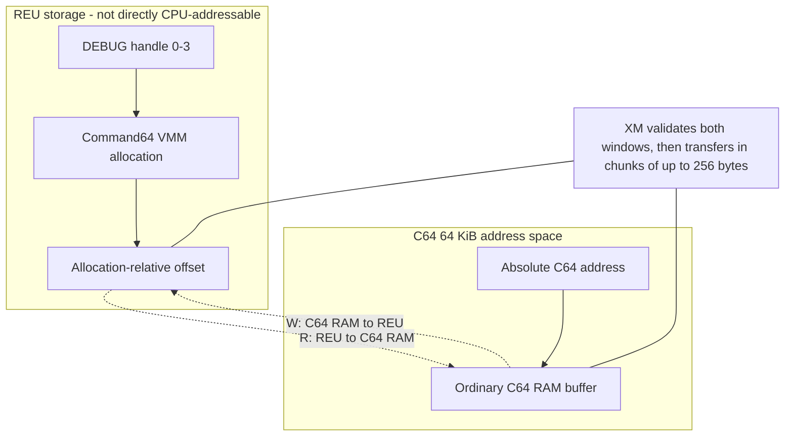

# DEBUG Utility User Guide

**Version:** 0.5.0 (C64 Command64 OS Port: Build 1128)
**Origin:** MS-DOS 4.0 / C64 Port
**Target Address:** `UserProgStart` (currently `$3800`, Standard User Program Space)

## Overview

`DEBUG` is a low-level machine-language monitor, memory editor, and debugger for the `command64` OS. It provides parity with MS-DOS `DEBUG` commands, enabling interactive memory inspection, disassembly, assembly, file loading/saving, and execution control for the MOS 6502 processor.

## Command Syntax

DEBUG uses a single-character command structure. All numerical values are in **hexadecimal** (case-insensitive). Command arguments are separated by spaces or commas.

### Help & Utilities

* **`?`**: Displays a summary of all available commands.
* **`V`**: Shows the utility's version and build information.
* **`Q`**: Exits `DEBUG` and returns to the `command64` shell prompt.

### Memory Manipulation

* **`D [range]`**: **Dump** memory. Displays 128 bytes (16 rows of 8 bytes) in Hex and PETSCII.
  * *Default:* If no arguments are provided, it dumps 128 bytes starting from the last accessed address.
  * *Syntax:* `D [address]` (dumps 128 bytes starting at `address`), `D [start] [end]` (dumps inclusive range), or `D [start] L [length]` (dumps `length` bytes).
* **`E address [list]`**: **Enter** data into memory starting at `address`.
  * *Interactive:* If no list is provided, prompts with `address xx :` where `xx` is the current value, allowing you to type a new hex byte or press `[Enter]` to skip to the next address. Press `[Enter]` on an empty prompt to exit.
  * *Direct:* `E address byte1 byte2 "string"` writes hex bytes and ASCII/PETSCII strings directly.
* **`F range list`**: **Fill** a memory range with a repeating pattern or list.
  * *Syntax:* `F start end list` or `F start L length list`.
  * *Example:* `F 0400 L 03E8 20` clears the 1000-byte screen memory with spaces (hex `$20`).
* **`M range address`**: **Move** (copy) a memory block to a new destination address.
  * *Safety:* Automatically handles overlapping regions by using backward-copy logic when `destination > source`.
* **`C range address`**: **Compare** two memory blocks. Prints the addresses and values of any mismatched bytes.
* **`S range list`**: **Search** a memory range for a specific byte sequence or string. Prints the starting hex address of each match.

### Assembly & Disassembly

* **`A [address]`**: **Assemble** 6502 instructions interactively.
  * *Default:* If no address is specified, starts at the last accessed address.
  * *Behavior:* Displays the target address as a prompt (e.g. `2000:`). Enter a standard 6502 instruction. Press `[Enter]` on an empty line to exit the assembly loop.
  * *Syntax:* Case-insensitive, supports all 13 standard addressing modes (e.g., `LDA #$01`, `STA $D020,X`, `LDA ($12),Y`).
* **`U [range]`**: **Unassemble** (disassemble) memory. Translates machine code into 6502 assembly mnemonics.
  * *Default:* If no range is specified, disassembles 16 instructions starting at the last accessed address.
  * *Syntax:* `U [address]`, `U [start] [end]`, or `U [start] L [length]`.

### System Inspection & Math

* **`R [register]`**: **Register** display and modification.
  * *R (no arguments):* Displays the virtual CPU state: `A=xx X=xx Y=xx P=xx S=xx PC=xxxx`.
  * *R [reg]:* Edit a register interactively (e.g. `R A`, `R PC`). Prompts with the current value and allows entering a new hex byte (or 16-bit word for `PC`).
  * *Editable registers:* `A`, `X`, `Y`, `P`, `S` (8-bit), `PC` (16-bit).
  * *Note:* The `P` register is entered and displayed as a raw hex byte. See [Processor Status Register Bits](#processor-status-register-bits) for flag layout.
* **`H val1 val2`**: **Hex** math helper. Displays the 16-bit sum and difference of the two values.

### File & Disk I/O

* **`N [filename]`**: **Name** file. Sets the active filename for subsequent Load (`L`) and Write (`W`) commands.
  * *Syntax:* `N filename.prg` (stores up to 32 characters in the filename buffer).
  * *Readback:* `N` with no arguments displays the currently stored filename.
* **`L [type] [address]`**: **Load** the named file into memory.
  * *Type Prefix:* Optional type prefix `P` (PRG, default), `S` (SEQ), or `U` (USR).
  * *Address Override:* If no address is specified, files of type `P` load back to the 2-byte starting address header saved in the file; `SEQ`/`USR` files default to the last accessed address. If `address` is specified, the file is relocated to that address.
* **`W [type] range`**: **Write** memory range to the named file.
  * *Type Prefix:* Optional type prefix `P` (PRG, default), `S` (SEQ), or `U` (USR).
  * *Syntax:* `W [type] start end` or `W [type] start L length`.
  * *Example:* `W P 2000 207F` writes range `$2000-$207F` as a program file.

### Execution Control

* **`G [address]`**: **Go**. Executes code starting at `address` via a subroutine call (`JSR`). If no address is specified, starts at the last accessed address. Target routines must end in an `RTS` to return control to the debugger.
* **`T [address]`**: **Trace**. Single-steps exactly one instruction, restoring registers, executing, trapping via `BRK`, and printing the updated register context and next disassembled instruction.
* **`P [address]`**: **Proceed**. Steps *over* subroutine calls (`JSR`), loops, or interrupts, executing the entire subroutine/loop without stopping and breaking on the instruction immediately following it.

### REU Extended Memory

The `X` command family gives DEBUG controlled access to Commodore REU memory
through the Command64 OS Virtual Memory Manager (VMM). DEBUG never programs the
REU DMA registers directly. All allocation, release, and transfer operations
use OS VMM services; `XM` validates a proposed transfer window and then
performs the real chunked transfer.

REU command operands are hexadecimal and must be separated by spaces. DEBUG
accepts command letters and hexadecimal digits without regard to shifted or
unshifted case.

| Command | Purpose |
| :--- | :--- |
| **`XA paragraphs`** | Allocate REU storage and assign a DEBUG handle. |
| **`XD handle`** | Release one allocation owned by this DEBUG session. |
| **`XM handle offset address length direction`** | Transfer data between an allocation and C64 memory, after validating the proposed window. |
| **`XS [handle]`** | Show VMM page counters and DEBUG allocation records, or one selected record. |

#### Mental Model: C64 RAM and REU Memory

The 6510 CPU can directly address only its 64 KiB C64 address space. REU memory
is separate storage; an REU byte does not appear at a normal CPU address and
cannot be inspected with `D` or changed with `E`. Data must be transferred
between an REU allocation and a buffer in C64 RAM:



This is why `XM` needs two addresses. The REU operand is an offset relative to
the beginning of a DEBUG allocation. The C64 operand is an absolute address in
the CPU's `$0000-$FFFF` address space. They describe opposite ends of one
proposed transfer; neither is a substitute for the other.

| Layer | Responsibility |
| :--- | :--- |
| **OS VMM** | Detects the REU, reserves contiguous 4 KiB pages, returns a starting segment/bank, releases allocations, and reports global page counts. |
| **DEBUG registry** | Assigns handles `0`-`3` to allocations made by this DEBUG session and retains each exact paragraph request. |
| **DEBUG command** | Parses operands, checks that the operation stays inside both the selected allocation and C64 address space, then performs the transfer in bounded chunks. |

#### REU Units and Addresses

The REU and VMM use several related units. They are not interchangeable:

| Field or unit | Meaning |
| :--- | :--- |
| **Paragraph** | 16 bytes. `XA` receives its requested size in paragraphs. |
| **Page** | 4 KiB, or `$0100` paragraphs. The OS allocator reserves complete pages. |
| **Handle** | A DEBUG-local selector from `0` through `3`. It is not an OS process ID, filename, or globally unique allocation number. |
| **`SEG`** | High byte of the allocation's bank-relative VMM segment returned by the OS. |
| **`BANK`** | VMM/REU bank containing the allocation start. Together, `SEG` and `BANK` identify the OS allocation for release and access. |
| **Flat offset** | A 16-bit byte offset from the beginning of the selected allocation, from `$0000` through `$FFFF`. |
| **Page-relative offset** | `page:offset`, where page is `$0-$F` and offset is `$000-$FFF`; DEBUG normalizes this to `page * $1000 + offset`. |

An allocation request is rounded up to complete 4 KiB pages. For example,
`XA 0001` requests 1 paragraph (16 bytes), reports `PARA=0001` and
`SIZE=0010`, but consumes one complete VMM page. `XM` deliberately validates
against the exact requested byte capacity (`PARA * 16`), not against unused
space in the rounded page. The padding therefore cannot be accessed through
that DEBUG handle.

#### Worked Size Calculations

Use these formulas to interpret an `XA` request:

```text
exact bytes    = paragraphs * $10
reserved pages = (paragraphs + $00FF) / $0100
reserved bytes = reserved pages * $1000
```

The page formula uses integer division. Adding `$00FF` before dividing rounds
every partial page up to a complete page.

| `XA` request | Exact capacity | Reserved pages | Reserved storage | Unaddressable padding |
| :---: | ---: | ---: | ---: | ---: |
| `0001` | `$0010` = 16 bytes | `01` | `$1000` = 4 KiB | `$0FF0` bytes |
| `0100` | `$1000` = 4 KiB | `01` | `$1000` = 4 KiB | None |
| `0101` | `$1010` = 4,112 bytes | `02` | `$2000` = 8 KiB | `$0FF0` bytes |
| `0800` | `$8000` = 32 KiB | `08` | `$8000` = 32 KiB | None |
| `1000` | `$10000` = 64 KiB | `10` | `$10000` = 64 KiB | None |

For `XA 0101`, `XS` reports `PARA=0101 PAGES=02 SIZE=1010`. Although the OS
must reserve `$2000` bytes, the handle's valid offsets stop at `$100F`. Offset
`$1010` is the first byte outside the exact allocation and is rejected. The
remaining `$0FF0` bytes are allocator padding, not extra capacity granted to
the DEBUG user.

#### Worked Offset Calculations

Flat and page-relative offsets describe the same allocation-relative byte
position:

```text
flat offset = page * $1000 + in-page offset
```

| Page-relative form | Calculation | Equivalent flat form |
| :---: | :--- | :---: |
| `0:000` | `$0 * $1000 + $000` | `0000` |
| `0:FFF` | `$0 * $1000 + $FFF` | `0FFF` |
| `1:000` | `$1 * $1000 + $000` | `1000` |
| `1:234` | `$1 * $1000 + $234` | `1234` |
| `F:FFF` | `$F * $1000 + $FFF` | `FFFF` |

These commands select the same REU window:

```text
XM 0 1234 6000 0020 R
XM 0 1:234 6000 0020 R
```

`SEG` and `BANK` are not entered in `XM`. They identify where the OS placed the
allocation, while the `XM` offset identifies a byte within it. DEBUG combines
its stored `SEG`/`BANK` record with the supplied offset. Treating `SEG` as an
offset would select the wrong logical location.

#### Allocation Records and Ownership

DEBUG maintains four private allocation records. Each active record contains
the handle, starting segment, bank, and requested paragraph count. These records
exist only for allocations made by the current DEBUG invocation:

* Bare `XS` obtains total, allocated, and free page counts from the OS, so those
  counters describe the complete VMM.
* The allocation rows following the counters come only from DEBUG's private
  four-record registry. They do not enumerate allocations made by the OS or by
  other applications.
* Command64 currently does not attach an application name or owner identity to
  an OS VMM allocation. DEBUG therefore cannot identify which application
  accounts for pages visible only in the global counters.
* A handle is valid only while its DEBUG record is active. Restarting DEBUG
  creates a new, empty registry; old numeric handles have no meaning in the new
  session.

#### `XA paragraphs` - Allocate

`XA` accepts `$0001-$1000` paragraphs, corresponding to 16 bytes through
64 KiB of exact requested capacity. A successful allocation uses the lowest
free DEBUG handle and prints:

```text
handle: SEG=xx BANK=xx PARA=xxxx PAGES=xx SIZE=xxxx
```

The fields mean:

| Field | Interpretation |
| :--- | :--- |
| `handle` | DEBUG handle `00`-`03`; commands accept the equivalent one-digit form. |
| `SEG` / `BANK` | Starting VMM address returned by `DOS_ALLOC_MEM`. |
| `PARA` | Exact paragraph request supplied to `XA`. |
| `PAGES` | Whole VMM pages reserved: `(paragraphs + $00FF) / $0100`, rounded down after the addition. |
| `SIZE` | Exact requested capacity in bytes. `$1000` paragraphs is displayed as the five-digit value `10000` (64 KiB). |

Examples:

```text
-XA 0001
00: SEG=02 BANK=00 PARA=0001 PAGES=01 SIZE=0010

-XA 0100
01: SEG=03 BANK=00 PARA=0100 PAGES=01 SIZE=1000

-XA 1000
02: SEG=04 BANK=00 PARA=1000 PAGES=10 SIZE=10000
```

`XA 0000` and values above `1000` are rejected. A fifth simultaneous
allocation is rejected because all four DEBUG handles are in use, even if the
OS still has free REU pages. Conversely, allocation can fail before all DEBUG
handles are occupied if the VMM is unavailable or lacks a sufficiently large
contiguous page run.

#### `XD handle` - Release

`XD` releases one active DEBUG allocation through `DOS_FREE_MEM`. Handles range
from `0` through `3`. Success is silent and clears the local record; the next
`XA` may reuse that handle. Invalid, inactive, and out-of-range handles are
rejected.

```text
-XD 1
-XS 1
ERROR
```

If the OS rejects the release, DEBUG leaves the record active so it remains
visible and the operation can be retried. This prevents a failed free from
being mistaken for a successful release.

#### `XS [handle]` - Status

`XS handle` prints the selected active record in exactly the same format as its
original `XA` result:

```text
-XS 1
01: SEG=03 BANK=00 PARA=0100 PAGES=01 SIZE=1000
```

Bare `XS` prints global VMM state and then DEBUG-local records:

```text
-XS
VMM ACTIVE
PAGES TOTAL=1000 ALLOC=0002 FREE=0FFE
00: SEG=02 BANK=00 PARA=0001 PAGES=01 SIZE=0010
01: SEG=03 BANK=00 PARA=0100 PAGES=01 SIZE=1000
```

The counter values above are illustrative; OS services and other applications
may already own pages before DEBUG starts.

`TOTAL`, `ALLOC`, and `FREE` count 4 KiB pages in hexadecimal. `TOTAL=1000`
therefore means 4096 pages, not 4096 bytes. `ALLOC + FREE` should equal
`TOTAL`. If no DEBUG records are active, `XS` prints `NONE`; this does not prove
that the global VMM has no allocations. Compare `ALLOC` with the listed DEBUG
rows, accounting for page rounding, to detect pages allocated elsewhere.

The current OS page-count reporting has a known unresolved stability issue:
`ALLOC` and `FREE` have been observed to change unexpectedly between status
queries, although their sum continues to equal `TOTAL`. Treat these counters as
diagnostic data rather than an ownership ledger.

#### `XM ... R|W` - Transfer

The complete grammar is:

```text
XM handle offset address length R
XM handle page:offset address length W
```

`handle` selects an active DEBUG allocation. `offset` is allocation-relative;
it may be a flat 16-bit byte offset or a `page:offset` pair. `address` is a
16-bit C64 address and `length` is a nonzero 16-bit byte count.

Direction is stated from the C64 CPU's perspective:

| Direction | Data flow |
| :---: | :--- |
| `R` | Read from the selected REU allocation into C64 memory. |
| `W` | Write from C64 memory into the selected REU allocation. |

Before performing any transfer, DEBUG proves both half-open windows are valid:

```text
REU window: [allocation offset, allocation offset + length)
C64 window: [C64 address, C64 address + length)
```

The REU window must fit within the exact `PARA * 16` capacity. The C64 window
may end exactly at `$10000` (for example, `$FF00` plus `$0100`) but may not wrap
through `$0000`. The page-relative form requires page `$0-$F` and an in-page
offset no greater than `$0FFF`. A zero length, trailing operand, unknown
direction, inactive handle, or either overflowing window is rejected before
any VMM transfer service can be called.

Once both windows validate, DEBUG performs the transfer in bounded chunks of
at most 256 bytes, restaging every OS parameter fresh before each chunk. A
successful transfer prints the exact number of bytes moved:

```text
-XM 0 0000 6000 0010 R
XM XFER=0010 OK

-XM 0 0:000 6000 0010 W
XM XFER=0010 OK
```

A runtime OS failure stops the transfer immediately and reports exactly how
many bytes were moved before the failure, followed by the generic error text:

```text
XM XFER=0080 FAILED
ERROR
```

#### Session Cleanup

`Q` attempts to release every active DEBUG allocation before returning to the
shell. It checks all four records even if one release fails. Successfully freed
records are cleared; failed records remain active. If any allocation remains,
DEBUG prints `ERROR` and stays running so `XS` can inspect the state and `XD` or
`Q` can retry cleanup. This behavior avoids silently leaking a known allocation.

An abnormal exit, reset, crash, or execution path that bypasses `Q` cannot run
this cleanup. The OS does not currently reclaim VMM allocations by application
owner, so such allocations can remain reserved until explicitly freed or until
the VMM is reinitialized.

#### Complete Session: Allocate, Inspect, Validate, and Release

This session requests 4 KiB, examines the resulting record, validates both
intended transfer directions, releases the allocation, and confirms that its
handle is inactive:

```text
-XA 0100
00: SEG=02 BANK=00 PARA=0100 PAGES=01 SIZE=1000
```

Handle `0` now represents exactly `$1000` bytes at allocation-relative offsets
`$0000-$0FFF`. `SEG=02 BANK=00` is the placement chosen by the OS; later
commands use handle `0`, not those placement fields.

```text
-XS 0
00: SEG=02 BANK=00 PARA=0100 PAGES=01 SIZE=1000

-XM 0 0000 6000 0100 W
XM XFER=0100 OK
```

The `W` copies `$0100` bytes from C64 `$6000-$60FF` to allocation offsets
`$0000-$00FF`.

```text
-XM 0 0:F00 7000 0100 R
XM XFER=0100 OK
```

The `R` copies the allocation's final `$0100` bytes, offsets `$0F00-$0FFF`,
into C64 `$7000-$70FF`. The transfer ends exactly at allocation offset
`$1000`, so the half-open window fits.

```text
-XD 0
-XS 0
ERROR
```

`XD` is silent on success. The subsequent error is expected: handle `0` is no
longer active.

#### Complete Session: Multiple Handles and Slot Reuse

DEBUG always assigns the lowest inactive handle:

```text
-XA 0001
00: SEG=02 BANK=00 PARA=0001 PAGES=01 SIZE=0010
-XA 0100
01: SEG=03 BANK=00 PARA=0100 PAGES=01 SIZE=1000
-XA 0200
02: SEG=04 BANK=00 PARA=0200 PAGES=02 SIZE=2000

-XD 1
-XA 0080
01: SEG=03 BANK=00 PARA=0080 PAGES=01 SIZE=0800
```

The new allocation reuses DEBUG handle `1`. Its `SEG`/`BANK` may or may not
match the previous allocation because placement is decided independently by the
OS allocator. Never assume that reusing a handle also reuses an REU address or
preserves old data.

#### Reading Bare `XS` in Different Situations

The rows and counters answer different questions:

| Observation | Interpretation |
| :--- | :--- |
| `VMM INACTIVE`, zero counters, `NONE` | The OS VMM is unavailable, normally because no supported REU was detected at initialization. `XA` cannot succeed. |
| `VMM ACTIVE`, `ALLOC=0000`, `NONE` | The VMM is available and currently reports no reserved pages; DEBUG owns no records. |
| `VMM ACTIVE`, nonzero `ALLOC`, one or more rows | The counters include every OS allocation; the rows describe only allocations made by this DEBUG session. |
| `VMM ACTIVE`, nonzero `ALLOC`, `NONE` | Pages are reserved outside the current DEBUG registry, or remain from an abnormal lifecycle. DEBUG cannot name their owner or release them by a DEBUG handle. |
| Rows account for fewer pages than `ALLOC` | The difference belongs outside this DEBUG registry. Account for each row using its `PAGES` field, not `PARA`. |

For example:

```text
VMM ACTIVE
PAGES TOTAL=1000 ALLOC=0005 FREE=0FFB
00: SEG=04 BANK=00 PARA=0100 PAGES=01 SIZE=1000
01: SEG=05 BANK=00 PARA=0101 PAGES=02 SIZE=1010
```

The two rows account for three pages (`01 + 02`), while `ALLOC=0005` reports
five globally allocated pages. The remaining two pages are outside this DEBUG
session. Nothing in this output identifies the allocating application.

#### Boundary Examples

Assume handle `0` came from `XA 0100`, giving exact offsets `$0000-$0FFF`:

| Command | Result | Reason |
| :--- | :---: | :--- |
| `XM 0 0FF0 6000 0010 R` | `XM XFER=0010 OK` | REU end is exactly `$1000`; final included offset is `$0FFF`. |
| `XM 0 0FF0 6000 0011 R` | `ERROR` | REU end would be `$1001`, one byte beyond capacity. |
| `XM 0 1000 6000 0001 R` | `ERROR` | The starting offset is already at the exclusive end. |
| `XM 0 0:FFF 6000 0001 R` | `XM XFER=0001 OK` | One byte at the last position of page 0 fits. |
| `XM 0 1:000 6000 0001 R` | `ERROR` | Flat offset `$1000` is outside this one-page exact capacity. |
| `XM 0 10:000 6000 0001 R` | `ERROR` | Page `$10` is outside the grammar's `$0-$F` range. |
| `XM 0 0:1000 6000 0001 R` | `ERROR` | In-page offset `$1000` exceeds `$0FFF`. |
| `XM 0 0000 FF00 0100 R` | `XM XFER=0100 OK` | C64 window ends exactly at `$10000`; final included address is `$FFFF`. |
| `XM 0 0000 FF00 0101 R` | `ERROR` | C64 window would wrap to `$0000`. |
| `XM 0 0000 6000 0000 R` | `ERROR` | Zero-length transfers are not meaningful and are rejected. |

For a padded `XA 0101` allocation, offsets `$0000-$100F` are valid even though
two pages were reserved:

```text
-XM 0 100F 6000 0001 R
XM XFER=0001 OK
-XM 0 1010 6000 0001 R
ERROR
```

The second command cannot use allocator padding merely because `PAGES=02`.

#### Demonstrating a Round-Trip Transfer

This session stashes recognizable bytes from C64 RAM into REU, clears the C64
source range, then fetches the bytes back and confirms they are identical:

```text
-XA 0100
00: SEG=02 BANK=00 PARA=0100 PAGES=01 SIZE=1000
-E 6000 AA 55 12 34
-D 6000 L 0004
6000: AA 55 12 34
-XM 0 0000 6000 0004 W
XM XFER=0004 OK
-E 6000 00 00 00 00
-D 6000 L 0004
6000: 00 00 00 00
-XM 0 0000 6000 0004 R
XM XFER=0004 OK
-D 6000 L 0004
6000: AA 55 12 34
```

The restored sentinel confirms the round trip: `W` moved the four bytes into
the allocation, and the subsequent `R` fetched the same bytes back into C64
RAM after the source range was cleared.

#### Troubleshooting REU Commands

Because DEBUG currently prints generic `ERROR`, diagnose failures from command
state and boundaries:

| Symptom | Likely cause | Check | Corrective action |
| :--- | :--- | :--- | :--- |
| `XA` fails immediately | VMM inactive, invalid paragraph count, or malformed/trailing input | Run bare `XS`; verify `$0001-$1000` and spaces between operands | Enable/configure an REU before OS boot, or correct the request. |
| Fifth `XA` fails while `FREE` is nonzero | All four DEBUG registry slots are active | Run bare `XS` and count rows | Release an unneeded handle with `XD`; OS free pages do not increase DEBUG's four-handle limit. |
| `XA` fails with a free handle and nonzero `FREE` | No sufficiently large contiguous page run, or unstable OS counter data | Compare requested `PAGES` with status; try a smaller request | Release allocations or reboot/reinitialize only when safe. Do not assume total free pages are contiguous. |
| `XD`, `XS handle`, or `XM` fails | Handle is malformed, outside `0`-`3`, or inactive | Run bare `XS` and inspect listed handles | Use an active listed handle; handles from a previous DEBUG session are invalid. |
| `XM` fails near allocation end | Offset plus length exceeds exact `SIZE` | Convert `PARA * $10`; compare the exclusive end | Reduce offset or length. Do not calculate from rounded `PAGES`. |
| `XM` fails near `$FFFF` | C64 address plus length wraps beyond `$10000` | Calculate the exclusive C64 end | Reduce length or choose a lower C64 address. |
| `XM` prints `XM XFER=xxxx FAILED` | A runtime OS failure interrupted the transfer mid-chunk | Note the printed count; it is the exact number of bytes moved before the failure | Retry the remaining window (offset + printed count, length reduced by it), or investigate the OS/VMM failure before retrying. |
| `Q` prints `ERROR` and DEBUG remains open | At least one OS release failed | Run `XS` to see records that remain active | Retry `XD handle` or `Q`; do not force exit if preserving allocator state matters. |
| Bare `XS` prints `NONE` but `ALLOC` is nonzero | Allocations exist outside DEBUG's local registry | Compare global `ALLOC` with listed rows | DEBUG cannot identify or release those allocations by local handle. |

#### Safe Operating Checklist

* Use `XS` before allocating to establish VMM availability and a diagnostic
  baseline.
* Calculate exact capacity from `PARA`; use `PAGES` only to understand physical
  VMM consumption.
* Keep track of each handle's purpose. A handle identifies a DEBUG record, not
  an application or permanent REU address.
* Validate the final byte on both sides: `offset + length - 1` for REU and
  `address + length - 1` for C64 RAM.
* A partial `XM XFER=xxxx FAILED` result means exactly `xxxx` bytes moved
  before the failure; use that count to resume or verify, not the originally
  requested length.
* Release individual allocations with `XD` when finished and leave DEBUG through
  `Q` so its cleanup pass runs.
* After a cleanup error, inspect with `XS` and retry rather than assuming the
  allocation was freed.

---

## Examples in Action

This section provides exhaustive examples demonstrating every command and syntax variation.

### 1. Help & Version Utility Commands

* **Show Command Help (`?`)**:

    ```text
    -?
    DEBUG COMMANDS:
    A [ADDR]    - ASSEMBLE
    D [RANGE]   - DUMP MEMORY
    ...
    Q           - QUIT TO SHELL
    ```

* **Show Version Info (`V`)**:

    ```text
    -V
    DEBUG v0.5.0.1128
    ```

* **Quit Utility (`Q`)**:

    ```text
    -Q
    C64:> 
    ```

### 2. Memory Dump Variations (`D`)

* **Default 128-byte Dump (`D`)** (dumps starting from `currentAddr`, advances pointer by 128):

    ```text
    -D
    0000: 00 11 22 33 44 55 66 77  .!"#$%&'
    ...
    ```

* **Dump from Address (`D address`)**:

    ```text
    -D 2000
    2000: A9 01 8D 20 D0 60 00 00  ... .`..
    ...
    ```

* **Dump Inclusive Range (`D start end`)**:

    ```text
    -D 2000 200F
    2000: A9 01 8D 20 D0 60 00 00  ... .`..
    2008: 11 22 33 44 55 66 77 88  ."3DUfww
    ```

* **Dump Explicit Length (`D start L length`)**:

    ```text
    -D 2000 L 0A
    2000: A9 01 8D 20 D0 60 00 00  ... .`..
    2008: 11 22                    ."
    ```

### 3. Memory Enter Variations (`E`)

* **Interactive Byte Editing (`E address`)** (Press `[Enter]` on empty prompt to skip or exit):

    ```text
    -E 2500
    2500: A9 : 4C     ; Overwrites value at $2500 with $4C
    2501: 20 :        ; Empty input, leaves $20 at $2501 unmodified
    2502: D0 : 08     ; Overwrites value at $2502 with $08
    2503: 60 :        ; Empty input, exits interactive mode
    ```

* **Direct List Entry (`E address byte1 byte2...`)**:

    ```text
    -E 2000 A9 01 8D 20 D0 60
    ```

* **Direct String & Byte Entry (`E address "string" bytes...`)**:

    ```text
    -E 3000 "C64 OS" 0D 00
    ```

### 4. Memory Fill Variations (`F`)

* **Fill Range with Single Byte (`F start end byte`)**:

    ```text
    -F C000 C0FF 00   ; Zero-fill memory from $C000 to $C0FF
    ```

* **Fill Range with Alternating List (`F start end byte1 byte2...`)**:

    ```text
    -F 0400 07E7 20 01 ; Fills screen memory with spaces colored white (alternating $20 $01)
    ```

* **Fill Length with Pattern (`F start L length pattern...`)**:

    ```text
    -F 1000 L 100 AA 55 ; Fills 256 bytes starting at $1000 with alternating AA 55 AA 55
    ```

### 5. Memory Move Variations (`M`)

* **Move Range to Destination (`M start end dest`)**:

    ```text
    -M 1000 1FFF 2000 ; Copies 4KB block from $1000-$1FFF to $2000-$2FFF
    ```

* **Move Length to Destination (`M start L length dest`)**:

    ```text
    -M 1000 L 0100 2000 ; Copies 256 bytes from $1000-$10FF to $2000-$20FF
    ```

* **Overlapping Move Safety**:
    If source and destination overlap (e.g. copying 16 bytes from `$1000` to `$1001`):

    ```text
    -M 1000 100F 1001
    ```

    *Note: DEBUG detects that `dest > source` and performs a backward copy from the tail end, ensuring that bytes are not overwritten before they are copied.*

### 6. Memory Compare Variations (`C`)

* **Compare Range to Address (`C start end dest`)**:

    ```text
    -C 1000 1007 2000
    ```

    If mismatched, outputs differences in format `[addr1] [val1] [val2] [addr2]`:

    ```text
    1002 A9 8D 2002   ; Mismatch at offset $02: source has $A9, dest has $8D
    1005 60 RTS 2005  ; Mismatch at offset $05: source has $60, dest has $FF
    ```

    *If blocks are identical, returns immediately with no output.*
* **Compare Length to Address (`C start L length dest`)**:

    ```text
    -C 1000 L 10 3000 ; Compares 16 bytes starting at $1000 with the 16 bytes at $3000
    ```

### 7. Memory Search Variations (`S`)

* **Search Range for Byte Pattern (`S start end bytes`)**:

    ```text
    -S 1000 2000 A9 00 8D
    10A4              ; Found sequence starting at $10A4
    1F82              ; Found sequence starting at $1F82
    ```

* **Search Length for String (`S start L length "string"`)**:

    ```text
    -S 1000 L 1000 "KERNAL"
    13C0              ; Found string "KERNAL" starting at $13C0
    ```

### 8. Inline Assembler Variations (`A`)

* **Assemble at Last Accessed Address (`A`)**:

    ```text
    -A
    1000: LDA #$01
    1002: RTS
    1003: 
    ```

* **Assemble at Specific Address (`A address`)** (Pressing `[Enter]` on empty prompt exits):

    ```text
    -A 2000
    2000: LDX #$00       ; Immediate Mode (without '$' prefix is decimal/hex-deduced)
    2002: LDA $12,X      ; Zero Page,X Indexed
    2004: STA $D020,X    ; Absolute,X Indexed
    2007: JMP ($1234)    ; Indirect
    200A: BNE $2002      ; Relative Branch (automatically calculates relative offset)
    200C: RTS            ; Implied Mode
    200D: 
    ```

### 9. Unassembler / Disassembler Variations (`U`)

* **Unassemble Default Count (`U`)** (disassembles 16 instructions starting from last accessed address):

    ```text
    -U
    1000  A9 01      LDA #$01
    1002  E8         INX
    ...
    ```

* **Unassemble from Address (`U address`)**:

    ```text
    -U 2000
    2000  A2 00      LDX #$00
    2002  B5 12      LDA $12,X
    ...
    ```

* **Unassemble Inclusive Range (`U start end`)**:

    ```text
    -U 2000 2007
    2000  A2 00      LDX #$00
    2002  B5 12      LDA $12,X
    2004  9D 20 D0   STA $D020,X
    2007  6C 34 12   JMP ($1234)
    ```

* **Unassemble Explicit Length (`U start L length`)**:

    ```text
    -U 2000 L 04
    2000  A2 00      LDX #$00
    2002  B5 12      LDA $12,X
    ```

### 10. Register View & Modification Variations (`R`)

* **Display Registers (`R`)**:

    ```text
    -R
    A=00 X=12 Y=FF P=30 S=FD PC=2000
    ```

* **Edit 8-bit Register (`R reg`)**:

    ```text
    -R A
    A 00
    : 85              ; Set Accumulator to $85
    ```

* **Edit 16-bit Program Counter (`R PC`)**:

    ```text
    -R PC
    PC 2000
    : C000            ; Set Program Counter to $C000
    ```

### 11. Hexadecimal Arithmetic (`H`)

* **Hex Math (`H val1 val2`)** (prints 16-bit sum and difference):

    ```text
    -H 1000 0050
    1050 0FB0         ; Sum is $1050, Difference is $0FB0
    ```

* **Hex Math with Underflow/Overflow Wrap**:

    ```text
    -H FFFF 0001
    0000 FFFE         ; FFFF + 1 = 0000 (wrap), FFFF - 1 = FFFE
    ```

### 12. Filename Configuration (`N`)

* **Read Current Filename (`N`)**:

    ```text
    -N
    MYAPP.PRG         ; Displays active filename (or returns immediately if empty)
    ```

* **Set New Filename (`N filename`)**:

    ```text
    -N NEWDATA.SEQ
    ```

### 13. File Load Variations (`L`)

* **Load Default Program (`L`)** (reads filename from name buffer, loads to header address):

    ```text
    -N MYAPP.PRG
    -L
    ```

* **Load Relocated Program (`L address`)** (ignores the file's starting address header, relocates to `address`):

    ```text
    -N MYAPP.PRG
    -L 4000           ; Loads MYAPP.PRG starting at $4000
    ```

* **Load Sequential File (`L S address`)** (uses byte-by-byte file stream loading):

    ```text
    -N TEST.SEQ
    -L S 5000         ; Loads sequential stream to $5000
    ```

* **Load User File (`L U address`)**:

    ```text
    -N USER.USR
    -L U 6000         ; Loads user stream to $6000
    ```

### 14. File Write Variations (`W`)

* **Write Range as Default Program (`W start end`)** (prepends the 2-byte header with `start` address):

    ```text
    -N OUT.PRG
    -W 2000 207F      ; Saves range $2000-$207F into OUT.PRG
    ```

* **Write Range Explicitly (`W type start end`)**:

    ```text
    -N OUT.SEQ
    -W S 4000 40FF    ; Saves range $4000-$40FF into OUT.SEQ as a Sequential file
    ```

* **Write Length Syntax (`W [type] start L length`)**:

    ```text
    -N OUT.USR
    -W U 5000 L 80    ; Saves 128 bytes starting at $5000 into OUT.USR as a User file
    ```

### 15. Execution Control Variations (`G`, `T`, `P`)

* **Go at Default PC (`G`)** (executes starting at last accessed memory address):

    ```text
    -G
    ```

* **Go at Specific Address (`G address`)**:

    ```text
    -G C000           ; Subroutine executes and returns to DEBUG prompt on RTS
    ```

* **Trace One Step (`T`)** (executes instruction at current `PC`, displays next instruction):

    ```text
    -T
    A=01 X=12 Y=FF P=30 S=FD PC=2002
    2002  E8         INX
    ```

* **Trace One Step from Address (`T address`)**:

    ```text
    -T 2000           ; Sets virtual PC to $2000 and single-steps
    A=01 X=12 Y=FF P=30 S=FD PC=2002
    2002  E8         INX
    ```

* **Proceed Step-Over (`P`)** (steps over subroutines, loops, and interrupts):

    ```text
    -U 2000 L 03
    2000  20 00 C0   JSR $C000   ; Subroutine call
    2003  E8         INX
    -R PC
    PC 2000
    : 2000
    -P                ; Step OVER the JSR call
    A=10 X=12 Y=FF P=30 S=FD PC=2003
    2003  E8         INX
    ```

* **Proceed from Address (`P address`)**:

    ```text
    -P 2000           ; Set virtual PC to $2000 and step-over
    ```

### 16. REU Extended Memory (`XA`, `XD`, `XM`, `XS`)

These examples assume Command64 was booted with an REU available. Allocation
addresses and global page counts are illustrative; `SEG`, `BANK`, `ALLOC`, and
`FREE` can differ when other OS components already own pages.

* **Check VMM Availability (`XS`)**:

    ```text
    -XS
    VMM ACTIVE
    PAGES TOTAL=1000 ALLOC=0002 FREE=0FFE
    NONE
    ```

    The counters are hexadecimal counts of 4 KiB pages. `NONE` means this DEBUG
    session owns no handles, not that the global allocated count is zero.

* **Allocate and Inspect 4 KiB (`XA`, `XS handle`)**:

    ```text
    -XA 0100
    00: SEG=02 BANK=00 PARA=0100 PAGES=01 SIZE=1000
    -XS 0
    00: SEG=02 BANK=00 PARA=0100 PAGES=01 SIZE=1000
    ```

    `$0100` paragraphs equal `$1000` bytes and occupy one VMM page. DEBUG assigns
    the lowest free handle. Later commands select handle `0`; they do not take
    the displayed `SEG` and `BANK` as operands.

* **Write to REU and Read Back (`XM ... W`, `XM ... R`)**:

    ```text
    -E 6000 11 22 33 44 55 66 77 88
    -XM 0 0000 6000 0008 W
    XM XFER=0008 OK
    -E 6000 00 00 00 00 00 00 00 00
    -XM 0 0000 6000 0008 R
    XM XFER=0008 OK
    -D 6000 L 0008
    6000: 11 22 33 44 55 66 77 88
    ```

    `W` copies eight bytes from C64 RAM into allocation offsets `$0000-$0007`.
    After the C64 bytes are cleared, `R` restores them from REU. `XFER=0008` is
    the exact number of bytes moved, not the allocation size.

* **Use Equivalent Flat and Page-Relative Offsets**:

    ```text
    -XA 0200
    01: SEG=03 BANK=00 PARA=0200 PAGES=02 SIZE=2000
    -E 6100 DE AD BE EF
    -XM 1 1234 6100 0004 W
    XM XFER=0004 OK
    -XM 1 1:234 6200 0004 R
    XM XFER=0004 OK
    -D 6200 L 0004
    6200: DE AD BE EF
    ```

    `1234` and `1:234` identify the same allocation-relative byte because
    `$1 * $1000 + $234 = $1234`.

* **Transfer More Than One Internal Chunk**:

    ```text
    -XM 1 0000 6000 0300 W
    XM XFER=0300 OK
    ```

    `$0300` bytes require three bounded chunks. DEBUG dispatches them internally
    and reports one total; users do not split transfers at 256-byte boundaries.

* **Accept Exact Ends and Reject Overflows**:

    Handle `0` has exact offsets `$0000-$0FFF`:

    ```text
    -XM 0 0FF0 6000 0010 R
    XM XFER=0010 OK
    -XM 0 0FF0 6000 0011 R
    ERROR
    -XM 0 0000 FF00 0100 R
    XM XFER=0100 OK
    -XM 0 0000 FF00 0101 R
    ERROR
    ```

    The valid windows end exactly at their exclusive `$1000` and `$10000`
    boundaries. Adding one byte would exceed the allocation or wrap C64
    addressing through `$0000`, so validation rejects it before DMA.

* **Release and Confirm an Inactive Handle (`XD`)**:

    ```text
    -XD 0
    -XS 0
    ERROR
    -XS
    VMM ACTIVE
    PAGES TOTAL=1000 ALLOC=0004 FREE=0FFC
    01: SEG=03 BANK=00 PARA=0200 PAGES=02 SIZE=2000
    ```

    `XD` is silent on success. Handle `0` becomes inactive while handle `1`
    remains listed. The next allocation reuses handle `0` before a higher slot.

* **Exit with Automatic Cleanup (`Q`)**:

    ```text
    -Q
    C64:>
    ```

    `Q` frees every active DEBUG allocation before returning to the shell. If a
    release fails, DEBUG prints `ERROR` and remains open so `XS` can identify
    surviving records and cleanup can be retried.

---

## Processor Status Register Bits

The `P` register (Processor Status) is a single byte displayed and edited as a hexadecimal value by the `R` command. Each bit is a CPU status flag. The layout for the MOS 6510 is:

```text
Bit:  7   6   5   4   3   2   1   0
Flag: N   V   1   B   D   I   Z   C
```

| Bit | Flag | Name | Description |
| :-: | :--: | :--- | :--- |
| 7 | **N** | Negative | Set if the result of the last operation had bit 7 set (was negative in signed arithmetic). |
| 6 | **V** | Overflow | Set if a signed arithmetic operation produced a result out of the –128 to +127 range. |
| 5 | **—** | *(Always 1)* | This bit is always read as `1`. Writing `0` has no effect. |
| 4 | **B** | Break | Set when a `BRK` instruction caused the last interrupt. Clear for hardware `IRQ`. Only meaningful when read off the stack after an interrupt. |
| 3 | **D** | Decimal | When set, `ADC` and `SBC` operate in BCD (Binary Coded Decimal) mode. The C64 KERNAL clears this on entry. |
| 2 | **I** | Interrupt Disable | When set, maskable `IRQ` interrupts are ignored. Does not affect `NMI` or `BRK`. |
| 1 | **Z** | Zero | Set if the result of the last operation was zero. |
| 0 | **C** | Carry | Set by arithmetic operations on overflow out of bit 7, or by compare/rotate instructions. |

### Common P Values

| Hex | Binary | Meaning |
| :-: | :----- | :------ |
| `$30` | `0011 0000` | Power-on default. B and reserved bit set, all flags clear. |
| `$32` | `0011 0010` | B set, Zero flag set (result was zero). |
| `$31` | `0011 0001` | B set, Carry flag set. |
| `$B0` | `1011 0000` | Negative, B set (result was negative). |
| `$F0` | `1111 0000` | Negative, Overflow, B, Decimal all set. |

> **Tip:** To force the `N` flag before a trace, set `P` to `$B0`. To force `Z`, set `P` to `$32`.

---

## Error Messages

DEBUG reports errors with a brief message followed by a return to the `-` prompt. No error codes are used; all messages are descriptive English.

| Message | Command | Cause |
| :------ | :------ | :---- |
| `syntax error` | Any | Unrecognized command character, or argument format is invalid (e.g. non-hex digit in an address). |
| `bad address` | `D`, `E`, `F`, `M`, `C`, `S`, `G`, `T`, `P`, `U`, `W` | Start address is greater than end address, or a required address argument is missing. |
| `bad range` | `F`, `M`, `C`, `S`, `W` | The specified range or length is zero or malformed. |
| `file not found` | `L` | The filename stored by `N` does not exist on the active drive. |
| `disk error xx` | `L`, `W` | The C64 drive returned error code `xx` from the command channel (e.g. `62` = file not found, `63` = file exists). |
| `no filename` | `L`, `W` | A `L` or `W` was issued without first setting a filename with `N`. |
| `error: cannot trace target in ROM` | `T`, `P` | The decoded next-instruction target falls entirely within ROM (`$A000–$BFFF` or `$D000–$FFFF`), so no software breakpoint can be written. |
| `unknown register` | `R` | The register name provided is not one of `A`, `X`, `Y`, `P`, `S`, or `PC`. |
| `value out of range` | `R` | A 16-bit entry was expected but a value larger than `$FFFF` was entered, or a byte entry received a value larger than `$FF`. |
| `ERROR` | `XA` | Missing or trailing input; paragraph count outside `$0001-$1000`; all four DEBUG handles active; VMM unavailable; or no suitable contiguous allocation. |
| `ERROR` | `XD` | Missing, malformed, out-of-range, or inactive handle; trailing input; or OS release failure. A failed OS release leaves the record active. |
| `ERROR` | `XS` | Malformed, out-of-range, or inactive handle; trailing input; or failure obtaining OS system information. |
| `ERROR` | `XM` | Missing or trailing input; malformed value; inactive handle; invalid `page:offset`; zero length; direction other than `R`/`W`; REU window beyond exact allocation capacity; or C64 window wrapping beyond `$FFFF`. |
| `ERROR` | `Q` | At least one active DEBUG allocation could not be released. DEBUG remains running and preserves each failed record. |

REU handlers internally distinguish these cases, but the current user interface
renders all of them as the generic uppercase `ERROR`. Inspect the command and,
where applicable, use `XS` to distinguish registry state from VMM availability.

---

## MS-DOS Parity & Platform Notes

This section documents intentional deviations from MS-DOS `DEBUG` (v4.0) and summarizes which commands are architecture-specific or have adapted behavior on the 6502/C64 platform.

### Register Name Mapping

MS-DOS `DEBUG` targets the 8086/8088 and uses 16-bit segment/offset register names that have no 6502 equivalent. The mapping below shows the closest C64 `DEBUG` analogues:

| MS-DOS Register | MS-DOS Meaning | C64 DEBUG Equivalent | Notes |
| :--- | :--- | :--- | :--- |
| `AX` | Accumulator (16-bit) | `A` | 8-bit only on 6502. |
| `BX`, `CX`, `DX` | General purpose | — | No equivalent; 6502 is accumulator-based. |
| `SI`, `DI` | Index registers | `X`, `Y` | 8-bit only. |
| `IP` | Instruction Pointer | `PC` | 16-bit; same role. |
| `F` | Flags register | `P` | Bit layout differs; see [Processor Status Register Bits](#processor-status-register-bits). |
| `SP` | Stack Pointer | `S` | 8-bit page-1 offset on 6502 (stack is fixed at `$0100–$01FF`). |
| `CS`, `DS`, `ES`, `SS` | Segment registers | — | No memory segmentation on 6502; addressing is flat 16-bit. |

### Address Argument Syntax

MS-DOS `DEBUG` requires an `=` prefix for the entry address in `G`, `T`, and `P` to distinguish it from breakpoint addresses:

```text
MS-DOS:  G =C000 2000   (run from $C000, break at $2000)
C64:     G C000         (no = prefix; breakpoints not yet supported)
```

C64 `DEBUG` omits the `=` prefix. The entry address is always the first bare hex argument.

### Commands Not Applicable to 6502/C64

| MS-DOS Command | Reason Not Implemented |
| :---: | :--- |
| **`I port`** | MS-DOS input-from-port instruction. The 6502 has no `IN` opcode; all I/O is memory-mapped. Use `D` or `E` on the relevant SID/VIC/CIA address instead. |
| **`O port byte`** | MS-DOS output-to-port instruction. Same reason as `I`; write to the memory-mapped register directly. |

### Behavioral Differences from MS-DOS DEBUG

| Feature | MS-DOS DEBUG | C64 DEBUG |
| :--- | :--- | :--- |
| **`R F` flag display** | Shows symbolic flag names: `OV DN EI NG ZR AC PE CY` / `NV UP DI PL NZ NA PO NC`. Allows toggling individual flags by name. | `P` is shown and edited as a raw hex byte. Symbolic flag display is not implemented. |
| **`G` breakpoints** | `G [=address] [bp1 bp2 ...]` accepts up to 10 software breakpoint addresses. | `G [address]` accepts only the entry address. Inline breakpoints are not yet supported. |
| **`T count`** | `T [=address] [count]` traces up to `count` instructions in one command. | `T [address]` always executes exactly one instruction. Repeat count is not supported. |
| **`P count`** | `P [=address] [count]` proceeds over up to `count` instructions. | `P [address]` always proceeds over a single instruction or subroutine call. |
| **Error format** | `^ Error` with a caret pointing to the offending character. | Full English message on its own line; no caret position indicator. |
| **Numeric output radix** | Always hexadecimal; prefix `0x` not used. | Same — all values are hexadecimal, no prefix. |
| **`D` row width** | 16 bytes per row. | 8 bytes per row (optimized for the 40-column C64 display). |
| **PETSCII character column** | ASCII character column beside hex bytes. | PETSCII character column beside hex bytes (printable PETSCII `$20–$7E`). |
| **Extended-memory commands** | `XA`, `XD`, `XM`, and `XS` operate on EMS handles and pages. | The command names are retained, but they operate on Commodore REU storage through Command64 VMM services. Handles and address semantics are Command64-specific; `XM` validates both windows and performs bounded chunked transfers. |

---

## UI Behavior & Quirks

* **Prompt:** `-`
* **Line Editing:** Supports the **INST/DEL** key for destructive backspace.
* **Case Normalization:** Normalizes all letters (shifted or unshifted) to unshifted lowercase command characters and unshifted uppercase hex digits/mnemonics.
* **ROM Safeguards:** The `T` and `P` commands cannot set breakpoints in ROM (`$A000-$BFFF`, `$D000-$FFFF`). Attempting to step into ROM will automatically step over subroutine calls (`JSR`) or report an error to prevent the monitor from locking up.
