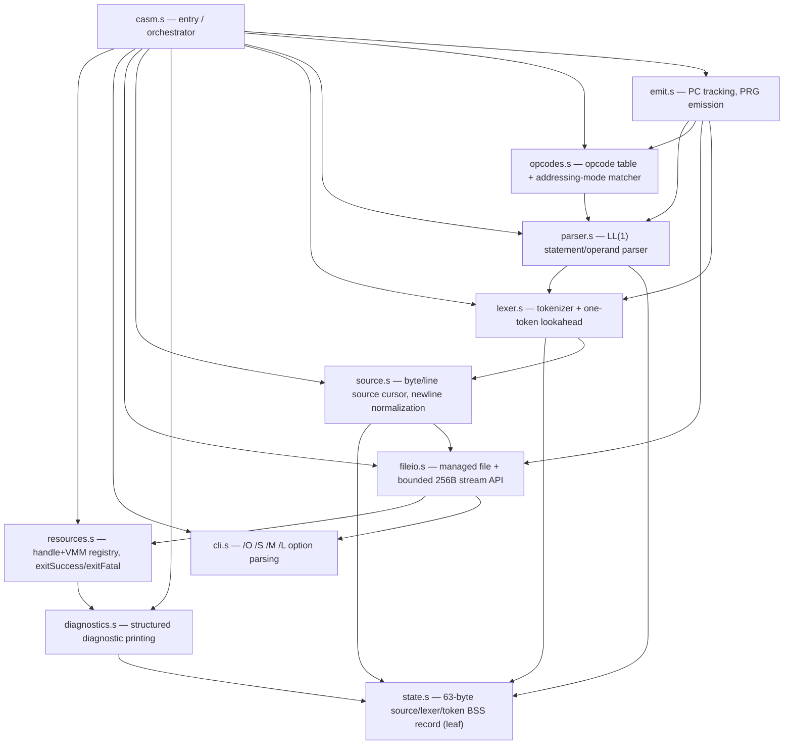
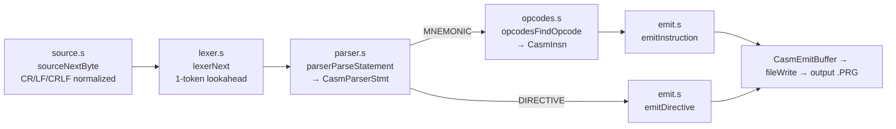

# CASM Programmer's Reference

CASM is command64's native 6502/6510 assembler: a ca65/ld65 external
application (`src/external/casm/`) that runs *on* the C64 and assembles
6502 source into a runnable PRG. This page documents its internal
architecture, module ABIs, data records, and diagnostic contract for anyone
extending CASM itself. For end-user command-line usage, see the (not yet
written) user manual; for the OS services CASM builds on, see
[api-reference.md](api-reference.md) and [programmers-reference.md](programmers-reference.md).

> **Status: Phase 4, in progress (build 1053, version 0.1.15).** CASM can
> already assemble a real subset of 6502 source to a working PRG (see
> [Coverage](#12-coverage-what-works-today) below). Orchestration/end-to-end
> validation (WP14) and the Phase 4 acceptance walkthrough are not yet done —
> see [wiki/tasks/casm.md](tasks/casm.md) for the live task list. Treat
> anything marked "not yet implemented" below as exactly that, not as a
> documentation gap.

## 1. Architecture

CASM is a layered pipeline, not a monolith. Each module is a separate ca65
translation unit linked together; dependencies point strictly downward
(`casm.s` orchestrates everything; `state.s` depends on nothing).



Runtime data flow per source statement:



`casm.s: start` runs this sequence: `resourcesInit → cliInit → fileIoInit →
sourceInit → cliParse → cliDeriveOutputName → sourceOpen → lexerInit →
fileCreateOutput → emitInit`, then loops `parserParseStatement` →
(`opcodesFindOpcode` + `emitInstruction`) or `emitDirective` until EOF, then
`emitFinalize → sourceClose → exitSuccess`. Every `bcs` after an init or
pipeline call routes to `exitFatal` (or, once output exists, `outputAbort`
then `exitFatal`) — see [§4](#4-resource-ownership--exit-contract).

## 2. Build & Toolchain

- Built with ca65/ld65 via the `add_ca65_app` CMake helper (`src/external/AGENTS.md`), not KickAssembler.
- Entry file: `casm.s`. Shared declarations: `common.inc`. Includes
  `include/ca65/command64.inc` for OS API/KERNAL symbols and
  `build_casm.inc` (CMake-generated) for `BUILD_NUMBER`.
- Current `MAIN` link envelope: `$2800` (raised from `$1000` → `$2000` →
  `$2800` across Phase 1-4 as features were added; see `wiki/tasks/casm.md`).
- Zero page: application-private range `$70-$8F` (32 bytes), declared once in
  `common.inc` and shared across translation units via `.exportzp`/`.importzp`
  where cross-file sharing is needed (`external/AGENTS.md` §Local Contracts).
- Version banner: `CASM V<major>.<minor>.<stage>.<build>`, defined in
  `casm.s` (currently `0.1.15`).

## 3. Zero-Page Contract (`common.inc`)

| Range | Alias(es) | Purpose |
|---|---|---|
| `$70-$77` | `CasmPtr0Lo/Hi`, `CasmPtr1Lo/Hi`, `CasmValue0Lo/Hi`, `CasmValue1Lo/Hi` | General pointers/values |
| `$78-$7F` | `CasmIoPtrLo/Hi`, `CasmIoLenLo/Hi`, `CasmVmmSegHi`, `CasmVmmBank`, `CasmVmmOffLo/Hi` | I/O and future VMM transfer scratch |
| `$80-$83` | `CasmParseScratch0-3` — aliased per-phase as `CasmCliPos/TokenStart/DestIndex/Scratch` (CLI) and `CasmSourceScratch0/1` + `CasmLexerScratch0/1` (source/lexer) | Transient parser/lexer scratch, never persistent across a public routine boundary |
| `$84-$87` | `CasmExprScratch0-3` | Expression/opcode-matcher scratch (used by `opcodes.s` as `ofResolvedMode`/`ofMaskLo`/`ofMaskHi`/`ofScratch`) |
| `$88-$8F` | `CasmPassScratch0-3`, `CasmEmitScratch0-3` | Pass/emission scratch (used by `emit.s` for relative-branch math) |

All 32 bytes are asserted (`CASM_ZP_SIZE = 32`) so a boundary change fails
the build loudly. Nothing here persists across an `OS_API` call — CASM state
that must survive lives in BSS instead.

## 4. Resource Ownership & Exit Contract (`resources.s`)

Every file handle CASM opens is registered with a central owner immediately
after the OS call succeeds, and every VMM allocation would be too (VMM
records are bounded stubs today — see [§12](#12-coverage-what-works-today)).
This makes `exitFatal` a single safe unwind path from anywhere in the
pipeline, at the cost of every call site checking `bcs` and jumping there.

| Routine | Purpose | Success | Failure |
|---|---|---|---|
| `resourcesInit` | Zero all ownership state and both registries (8 file + 8 VMM slots) | `C` clear | — |
| `resourceRegisterHandle` | Claim a file-registry slot for a handle just opened | `C` clear, `X` = slot 0-7 | `C` set, `A = CASM_DIAG_REGISTRY_FULL` |
| `resourceReleaseHandle` | Free a slot after its handle is closed | `C` clear | `C` set, `A = CASM_DIAG_UNKNOWN` (bad slot) |
| `resourceRegisterVmm` / `resourceReleaseVmm` | Same pattern for the VMM registry | mirrors above | mirrors above |
| `resourcesCleanup` | Best-effort, **repeat-safe** close of every owned file (guarded by `CasmCleanupGuard` against re-entry) | `C` clear | `C` set, `A = CASM_DIAG_CLEANUP_FAILED` if any close failed — the record stays owned so a later call retries it |
| `exitSuccess` | Clear last diagnostic, run `resourcesCleanup`, `DOS_EXIT` | does not return | prints a fatal message first if cleanup failed |
| `exitFatal` | `A` = primary diagnostic → print it, run `resourcesCleanup` (which cannot overwrite the primary), `DOS_EXIT` | does not return | — |

File records are `(flag, handle)` pairs (2 bytes × 8 slots); VMM records are
`(flag, seghi, bank)` triples (3 bytes × 8 slots). A failed close is left
`OWNED` (not `FREE`) specifically so a subsequent cleanup pass can retry it —
this is what makes `resourcesCleanup` safe to call twice.

## 5. Command Line (`cli.s`)

Syntax: `CASM <source> [/O:<output>] [/S] [/M] [/L]`. The source token and
options may appear in any order; `CommandBuffer` (the OS-owned 80-byte
buffer) is read but never modified.

| Option | Meaning | Status |
|---|---|---|
| *(bare filename)* | Source file (required, exactly one) | implemented |
| `/O:<name>` | Explicit output filename (≤63 chars) | implemented |
| `/S` | Static output | parsed and accepted; output is emitted by default regardless — see [§12](#12-coverage-what-works-today) |
| `/M` | Map file | parsed but rejected: `start` in `casm.s` fatals with `CASM_DIAG_NOT_IMPLEMENTED` if this bit is set |
| `/L` | Listing file | same as `/M` — parsed, then rejected |

Option letters are matched case-insensitively (`AND #$5F` before comparison);
filename bytes are copied verbatim, never case-folded. Duplicate options and
unknown `/X` options are rejected (`CASM_DIAG_DUPLICATE_OPTION` /
`CASM_DIAG_UNKNOWN_OPTION`).

**Output name derivation** (`cliDeriveOutputName`, used when `/O` is absent):
copy the source name, tracking the last `.` seen *after* the last `:`
(device-prefix colons reset the tracked dot, so `8:foo.bar` treats `.bar` as
the extension, not anything before the colon). If a dot was found, truncate
there and append `PRG`; otherwise append `.PRG`. Both cases bounds-check
against `CASM_FILENAME_MAX` (63) and fail with
`CASM_DIAG_FILENAME_TOO_LONG` rather than silently truncating.

## 6. File & Stream Services (`fileio.s`)

Wraps `DOS_OPEN_FILE`/`DOS_READ_FILE`/`DOS_WRITE_FILE`/`DOS_CLOSE_FILE`/
`DOS_DELETE_FILE` with registration and EOF normalization.

| Routine | Purpose |
|---|---|
| `fileOpenInput` / `fileCreateOutput` | Open (read) / create (write) a handle and register it in one step; a registration failure closes the just-opened handle to avoid an orphan |
| `fileRead` | Bounded read; a zero-length result (regardless of carry) normalizes to `CASM_STREAM_EOF` rather than being treated as an error |
| `fileWrite` | Bounded write; a short write (actual ≠ requested count) is treated as failure (`CASM_DIAG_OUTPUT_SHORT_WRITE`) even though the OS call itself reported success |
| `fileClose` | Close, then release the registry slot **only if** the OS close succeeded |
| `fileDelete` | Delete by name (no registration involved) |
| `inputStreamOpen/Read/ReadInto/Close` | The managed-input convenience layer `source.s` builds on; `inputStreamReadInto` tracks a checked 16-bit consumed-byte total and fails with `CASM_DIAG_SOURCE_OFFSET_OVERFLOW` past 65,535 bytes — i.e. **CASM cannot assemble a source file larger than 64K** |
| `outputAbort` | Best-effort close + delete of a partial output on a fatal path, preserving whichever diagnostic came first (primary) over any secondary cleanup failure |

`CasmIoBuffer` (256 bytes) is the single input transfer buffer, shared
between byte mode (whole buffer = transfer region) and line mode (see
[§7](#7-source-stream-layer-sources)).

## 7. Source Stream Layer (`source.s`)

Sits between the managed file wrapper and the lexer. Owns newline
normalization, line/column provenance, and a deterministic rewind — none of
which the raw file layer knows about.

- **Newline normalization**: `sourceNextByte` collapses CR, LF, and CRLF
  (including a CRLF split across a 256-byte block boundary, via a persistent
  "pending CR" latch) into one `CASM_SOURCE_NEWLINE` result. A raw byte comes
  back as `CASM_SOURCE_BYTE` in `CasmSourceResultByte`, which is **never**
  inferred from `A`/`Z` — a `0x00` source byte is a legal `BYTE` result, not
  end-of-line.
- **Location tracking**: one-based `CasmSourceLine{Lo,Hi}` and
  `CasmSourceColumn` (8-bit) advance per byte/newline, each with an explicit
  overflow check (`CASM_DIAG_SOURCE_LOCATION_OVERFLOW`) rather than silent
  wraparound.
- **Byte vs. line mode**: `sourceNextByte` and `sourceNextLine` are mutually
  exclusive per stream (`CasmSourceApiMode`). Line mode may only be claimed
  on a fresh, unconsumed stream; switching requires `sourceRewind`. Line mode
  partitions `CasmIoBuffer` — `[0..lineLength-1]` is the accumulated payload,
  `[lineLength..255]` is the live refill region — so a logical line survives
  a block boundary without a second buffer.
- **EOF is repeat-stable**: calling `sourceNextByte`/`sourceNextLine` again
  after EOF returns EOF again with no further OS call.
- **`sourceRewind`**: closes and reopens the source so a second traversal is
  byte-, newline-, and location-identical to the first. It does **not**
  invalidate the lexer's lookahead — that's the lexer's job
  (`lexerInit`), because lookahead is lexer state that `source.s` never
  writes.

## 8. Lexer (`lexer.s`)

One-token lookahead over the normalized byte stream. `lexerNext` skips
whitespace and `;`-comments (but still emits the newline that terminates a
comment) and classifies the next significant token into the persistent
`CasmTokenRecord` (`state.s`).

**Token types** (`CASM_TOKEN_*`, $00-$0F):
`EOF, NEWLINE, IDENTIFIER, MNEMONIC, DIRECTIVE, REGISTER, NUMBER, COMMA,
COLON, HASH, LPAREN, RPAREN, PLUS, MINUS, LESS, GREATER`.

Scanning rules:

| Lead byte | Result |
|---|---|
| `,` `:` `#` `(` `)` `+` `-` `<` `>` | Single-byte punctuation token, direct table lookup (`lexerPunctBytes`/`lexerPunctTypes`) |
| `.` | `DIRECTIVE`; text matched case-insensitively against `.ORG .BYTE .WORD .INCLUDE .STATIC .RELOC`, else subtype `CASM_DIRECTIVE_UNKNOWN` (still a valid token — rejected later by the parser/emitter) |
| `$` | `NUMBER`, subtype `HEX`; at least one hex digit required |
| `%` | `NUMBER`, subtype `BINARY`; at least one `0`/`1` required |
| `0-9` | `NUMBER`, subtype `DECIMAL` |
| `A-Z a-z _` (shifted PETSCII accepted and folded) | Identifier scan, then reclassified: exactly one char matching `A`/`X`/`Y` → `REGISTER`; else a case-insensitive 3-letter match against the 56-entry `mnemonicTable` → `MNEMONIC` (subtype = table index 0-55); else `IDENTIFIER` |
| anything else | `CASM_DIAG_INVALID_SOURCE_BYTE` |

Token text is bounded to 31 payload bytes (`CASM_TOKEN_TEXT_MAX`);
overflowing it is `CASM_DIAG_TOKEN_TOO_LONG`, not truncation. A malformed
number (e.g. `$` followed by a non-hex-digit, or a numeric literal
immediately followed by an identifier character) consumes the rest of the
run and reports `CASM_DIAG_MALFORMED_NUMBER`.

**`CasmTokenRecord` layout** (39 bytes total, in `state.s`):

| Offset | Field | Size |
|---|---|---|
| 0 | Type (`CASM_TOKEN_*`) | 1 |
| 1 | Subtype (directive/register/number/mnemonic index, or `CASM_SUBTYPE_NONE`) | 1 |
| 2 | Length (text payload length) | 1 |
| 3 | FileId | 1 |
| 4-5 | Line (lo/hi) | 2 |
| 6 | Column | 1 |
| 7-38 | Text (`CasmTokenText`, 31 payload bytes + null terminator) | 32 |

**Identifiers/labels are not yet a language feature.** The lexer classifies
`IDENTIFIER` tokens, but `parser.s` rejects any statement that starts with
one — see [§9](#9-parser-parsers) and [§12](#12-coverage-what-works-today).

## 9. Parser (`parser.s`)

An LL(1) statement/operand parser consuming the lexer's single-token buffer
directly (no separate token stream materialized). Populates the persistent
6-byte `CasmParserStmt` record consumed by `opcodes.s` and `emit.s`.

Grammar (informal EBNF; `.BYTE`/`.WORD` operand lists are read by `emit.s`,
not this grammar — the parser stops after classifying the directive):

```
statement      := NEWLINE | EOF | (MNEMONIC | DIRECTIVE) operandSeq
operandSeq     := terminator                              ; implied
                 | '#' NUMBER terminator                   ; immediate
                 | NUMBER [',' ('X'|'Y')] terminator        ; absolute/zp[,X/Y]
                 | 'A' terminator                           ; accumulator
                 | '(' NUMBER ')' [',' 'Y'] terminator       ; indirect / (zp),Y
                 | '(' NUMBER ',' 'X' ')' terminator          ; (zp,X)
terminator     := NEWLINE | EOF
```

Any statement beginning with `IDENTIFIER` — or any other unexpected token —
is `CASM_DIAG_SYNTAX_ERROR`. A well-formed operand sequence missing its
terminator is `CASM_DIAG_EXPECTED_NEWLINE`.

**`CasmParserStmt` layout** (6 bytes, in `parser.s`'s own BSS):

| Offset | Field | Meaning |
|---|---|---|
| 0 | Type | `CASM_TOKEN_MNEMONIC`/`CASM_TOKEN_DIRECTIVE`/`CASM_TOKEN_NEWLINE`/`CASM_TOKEN_EOF` |
| 1 | Subtype | Mnemonic index (0-55) or directive id |
| 2 | OpKind | `CASM_OPKIND_*` — the parser's coarse operand shape (see below) |
| 3-4 | ValLo/ValHi | Parsed 16-bit numeric operand |
| 5 | RegSubtype | `CASM_REGISTER_A/X/Y` when the operand named a register |

`OpKind` (`CASM_OPKIND_*`) is deliberately coarser than the final 6502
addressing mode — e.g. `ABSOLUTE` covers both zero-page and absolute; it's
`opcodes.s` that resolves the concrete mode against operand size and the
mnemonic's supported-mode mask. Values: `IMPLIED, ACCUMULATOR, IMMEDIATE,
ABSOLUTE, ABSOLUTE_X, ABSOLUTE_Y, INDIRECT, INDEXED_INDIRECT,
INDIRECT_INDEXED`.

**`parseNumericValue`**: converts the current `NUMBER` token's text
(`$`/`%` prefix already scanned by the lexer and skipped here) to a 16-bit
value via a **24-bit accumulator with a sticky overflow flag** — decimal
uses repeated ×10+digit, hex ×16+digit, binary ×2+digit, and the extra 8th
byte plus the sticky flag catch a value that would exceed 65,535 *regardless
of how many further digits follow*, rather than only checking the final
result. Overflow reports `CASM_DIAG_OPERAND_OUT_OF_RANGE`.

## 10. Opcode Table & Addressing-Mode Matcher (`opcodes.s`)

A pure function of `CasmParserStmt`: no I/O, no program-counter tracking, no
byte emission. `opcodesFindOpcode` resolves the parser's coarse `OpKind` to
one of 13 concrete `CASM_MODE_*` values, verifies the mnemonic actually
supports that mode, and fills the 3-byte `CasmInsn` record.

Resolution rules:

| Parser OpKind | Resolved mode |
|---|---|
| `IMPLIED` / `ACCUMULATOR` / `INDIRECT` | unchanged (1:1) |
| `IMMEDIATE` / `INDEXED_INDIRECT` / `INDIRECT_INDEXED` | unchanged, but requires `ValHi == 0` (`CASM_DIAG_OPERAND_OUT_OF_RANGE` otherwise) |
| `ABSOLUTE` | `RELATIVE` if the mnemonic's mask supports it (i.e. it's a branch — 16-bit target, no 8-bit check, displacement/range validated later in `emit.s`); else `ZEROPAGE` if `ValHi == 0` **and** the mnemonic supports `ZEROPAGE`; else `ABSOLUTE` |
| `ABSOLUTE_X` | `ZEROPAGE_X` if `ValHi == 0` and supported, else `ABSOLUTE_X` |
| `ABSOLUTE_Y` | `ZEROPAGE_Y` if `ValHi == 0` and supported (mask bit lives in the high mask byte), else `ABSOLUTE_Y` |

Each of the 56 mnemonics has a 13-bit "supported modes" bitmask
(`opcodeMaskLo`/`opcodeMaskHi`, bit position = `CASM_MODE_*` value) and a
start offset into a packed 151-entry `opcodeBytes` table
(`opcodeRunOffset`). Once the concrete mode is confirmed supported, the
opcode is found by counting how many of the mnemonic's *other* supported
mode bits sit below the resolved mode's bit — that count is the index into
its packed run. This is a purely mechanical scheme; extending it to an
unimplemented mnemonic means adding one mask/offset entry and its opcode
bytes in mode-bit order, not writing new matching logic.

**`CasmInsn` layout** (3 bytes): `Opcode` (selected byte), `Mode`
(`CASM_MODE_*`), `Length` (1-3, from a `CASM_MODE_COUNT`-entry
`modeLength` table).

Failure modes: `CASM_DIAG_INVALID_ADDR_MODE` (mode not in the mnemonic's
mask — e.g. `INX #5`) or `CASM_DIAG_OPERAND_OUT_OF_RANGE` (8-bit-only mode
given a 16-bit value).

## 11. Emission Engine (`emit.s`)

A single forward pass is sufficient because Phase 4 has no symbols or
forward references — every operand is already a literal by the time
`emit.s` sees it, so the program counter is always known. Output is a plain
absolute PRG with no relocation trailer (contrast with the OS's own R6
relocatable format used elsewhere in the project).

- **`CasmPc`** (2 bytes) tracks the next emit address; `.ORG` sets it once
  (a second `.ORG` is `CASM_DIAG_DUPLICATE_ORG`) and writes the 2-byte PRG
  load-address header via `emitRawByte` (which does **not** advance `CasmPc`
  — only `emitByte` does, and only for program bytes). Any instruction or
  `.BYTE`/`.WORD` before the first `.ORG` is `CASM_DIAG_ORG_REQUIRED`.
- **`emitInstruction`** writes the opcode then 0-2 operand bytes per
  `CasmInsn.Length`/`Mode`. `CASM_MODE_RELATIVE` is the one non-literal
  case: it computes `displacement = target − (CasmPc + 1)` (the `+1`
  accounts for the opcode byte already having advanced `CasmPc`) and
  rejects anything outside `-128..+127` with
  `CASM_DIAG_BRANCH_OUT_OF_RANGE` — this is the check WP12 deferred here
  from the opcode matcher, since it needs the current PC, not just the
  operand's raw size.
- **`emitByteList`/`emitWordList`** implement `.BYTE`/`.WORD` by reading a
  comma-separated `NUMBER` list directly off the lexer (the parser
  deliberately stopped after classifying the directive — see
  [§9](#9-parser-parsers)); at least one value is required, and `.BYTE`
  values must fit 8 bits (`CASM_DIAG_OPERAND_OUT_OF_RANGE` otherwise).
- **Output staging**: bytes accumulate in a 64-byte `CasmEmitBuffer`
  (`CASM_EMIT_BUFFER_SIZE`), separate from the 256-byte `CasmIoBuffer`
  input buffer because both are live simultaneously during the single
  assembly pass. `emitRawByte` flushes via `fileWrite` when the buffer
  fills; `emitFinalize` flushes whatever remains.
- **`.STATIC` / `.RELOC` / `.INCLUDE`** are recognized by the lexer as
  directives but rejected by `emitDirective` with
  `CASM_DIAG_NOT_IMPLEMENTED` — they're lexed, not yet assembled.

## 12. Coverage: What Works Today

As of build 1053 / v0.1.15 (Phase 4, WP13 complete, WP14 not started):

**Works:**
- All 56 legal, documented 6502 mnemonics across every addressing mode they
  support (implied, accumulator, immediate, zero page [,X/,Y], absolute
  [,X/,Y], indirect, `(zp,X)`, `(zp),Y`, relative).
- `.ORG`, `.BYTE`, `.WORD` directives.
- Full syntax/range/mode/branch-distance validation with a specific
  diagnostic per failure (36 distinct `CASM_DIAG_*` codes — [§13](#13-diagnostic-reference)).
- A real PRG is written by default; `casmhello` (in the project's test
  fixtures) is a runnable print-and-exit demo assembled this way.

**Not yet implemented** (each fails with a specific, non-silent diagnostic
rather than being silently accepted):
- **Labels/symbols** — any identifier at statement-start is
  `CASM_DIAG_SYNTAX_ERROR`. No forward references, no symbol table.
- **`.STATIC` / `.RELOC` / `.INCLUDE`** directives — `CASM_DIAG_NOT_IMPLEMENTED`.
- **`/M` (map) and `/L` (listing) output** — CLI-parsed, then `start`
  fatals with `CASM_DIAG_NOT_IMPLEMENTED` if either bit is set.
- **VMM-backed storage** — `resources.s`'s VMM registry and
  `resourceRegisterVmm`/`resourceReleaseVmm` are wired up, but nothing in
  the pipeline allocates VMM memory yet; large source/symbol/relocation
  tables are deferred to a separately approved phase per
  `src/external/casm/AGENTS.md`.
- **Sources over 64K** — `inputStreamReadInto`'s checked total overflows at
  65,536 bytes (`CASM_DIAG_SOURCE_OFFSET_OVERFLOW`).

## 13. Diagnostic Reference

All diagnostics are stable one-byte identifiers (`CASM_DIAG_*`) with a fixed
PETSCII message, looked up via a parallel low/high address table in
`diagnostics.s` (`diagPrintFatal`). Ranges are contiguous per phase and
asserted at build time; `$00` (`NONE`) and `$FF`/out-of-range (`UNKNOWN` →
`"CASM: INTERNAL ERROR"`) are the only gaps.

| Code | Identifier | Message | Raised by |
|---|---|---|---|
| `$01` | `INIT_FAILED` | INITIALIZATION FAILED | (reserved) |
| `$02` | `REGISTRY_FULL` | RESOURCE REGISTRY FULL | `resourceRegisterHandle`/`Vmm` |
| `$03` | `CLEANUP_FAILED` | RESOURCE CLEANUP FAILED | `resourcesCleanup` |
| `$04` | `SOURCE_REQUIRED` | SOURCE FILE REQUIRED | `cli.s` |
| `$05` | `EXTRA_SOURCE` | TOO MANY SOURCE FILES | `cli.s` |
| `$06` | `MALFORMED_OUTPUT_OPTION` | MALFORMED /O OPTION | `cli.s` |
| `$07` | `DUPLICATE_OPTION` | DUPLICATE OPTION | `cli.s` |
| `$08` | `UNKNOWN_OPTION` | UNKNOWN OPTION | `cli.s` |
| `$09` | `FILENAME_TOO_LONG` | FILENAME TOO LONG | `cli.s` |
| `$0A` | `NOT_IMPLEMENTED` | FEATURE NOT IMPLEMENTED | `casm.s` (`/M`,`/L`), `emit.s` (`.STATIC`/`.RELOC`/`.INCLUDE`) |
| `$0B` | `INPUT_OPEN_FAILED` | CANNOT OPEN INPUT | `fileio.s` |
| `$0C` | `INPUT_READ_FAILED` | INPUT READ FAILED | `fileio.s` |
| `$0D` | `INPUT_CLOSE_FAILED` | INPUT CLOSE FAILED | `fileio.s`/`source.s` |
| `$0E` | `OUTPUT_CREATE_FAILED` | CANNOT CREATE OUTPUT | `fileio.s` |
| `$0F` | `OUTPUT_WRITE_FAILED` | OUTPUT WRITE FAILED | `fileio.s` |
| `$10` | `OUTPUT_CLOSE_FAILED` | OUTPUT CLOSE FAILED | `fileio.s` |
| `$11` | `OUTPUT_DELETE_FAILED` | OUTPUT DELETE FAILED | `fileio.s` |
| `$12` | `OUTPUT_SHORT_WRITE` | SHORT OUTPUT WRITE | `fileio.s` |
| `$13` | `STREAM_STATE_FAILED` | INVALID STREAM STATE | `fileio.s`/`source.s` *(Phase 2 range ends here)* |
| `$14` | `SOURCE_REWIND_FAILED` | SOURCE REWIND FAILED | `source.s` |
| `$15` | `SOURCE_OFFSET_OVERFLOW` | SOURCE OFFSET OVERFLOW | `source.s` / `fileio.s` (>64K source) |
| `$16` | `SOURCE_LOCATION_OVERFLOW` | SOURCE LOCATION OVERFLOW | `source.s` (line/column overflow) |
| `$17` | `SOURCE_LINE_TOO_LONG` | SOURCE LINE TOO LONG | `source.s` (line mode, >255 bytes) |
| `$18` | `TOKEN_TOO_LONG` | TOKEN TOO LONG | `lexer.s` (>31 text bytes) |
| `$19` | `INVALID_SOURCE_BYTE` | INVALID SOURCE BYTE | `lexer.s` / `source.s` (embedded null in line mode) |
| `$1A` | `MALFORMED_NUMBER` | MALFORMED NUMBER | `lexer.s` |
| `$1B` | `LEXER_STATE_FAILED` | INVALID LEXER STATE | `lexer.s` *(Phase 3 range ends here)* |
| `$1C` | `SYNTAX_ERROR` | SYNTAX ERROR | `parser.s` / `emit.s` (unknown directive) |
| `$1D` | `EXPECTED_NEWLINE` | EXPECTED NEWLINE | `parser.s` |
| `$1E` | `OPERAND_OUT_OF_RANGE` | OPERAND OUT OF RANGE | `parser.s` (16-bit overflow), `opcodes.s` (8-bit modes), `emit.s` (`.BYTE` >255) |
| `$1F` | `INVALID_ADDR_MODE` | INVALID ADDRESSING MODE | `opcodes.s` |
| `$20` | `DUPLICATE_ORG` | DUPLICATE ORG | `emit.s` |
| `$21` | `ORG_REQUIRED` | ORG REQUIRED | `emit.s` |
| `$22` | `ADDRESS_OVERFLOW` | ADDRESS OVERFLOW | `emit.s` (`CasmPc` past `$FFFF`) |
| `$23` | `BRANCH_OUT_OF_RANGE` | BRANCH OUT OF RANGE | `emit.s` (relative displacement outside ±127) *(Phase 4 range ends here)* |
| `$FF` | `UNKNOWN` | INTERNAL ERROR | fallback for `$00`/out-of-range values |

## 14. Extending CASM

- **New directive**: add a `CASM_DIRECTIVE_*` constant and its name string in
  `lexer.s` (`dirOrgStr` etc. + the `compareTokenText` chain in
  `lnDirective`), bump `CASM_DIRECTIVE_COUNT`, then handle it in
  `emitDirective` (`emit.s`). If it takes a single operand rather than a
  comma-list, let `parser.s`'s existing grammar populate `CasmParserStmt`
  instead of adding it to the `.BYTE`/`.WORD` deferred-operand special case.
- **New mnemonic** (only if it's a legal, already-implemented 6502 opcode
  variant, since Phase 4 only targets documented opcodes): add its 3-letter
  name to `mnemonicTable` in `lexer.s`, bump `CASM_MNEMONIC_COUNT`, and add
  one mask/offset entry plus its packed opcode bytes (in ascending
  `CASM_MODE_*` bit order) to `opcodeMaskLo/Hi`, `opcodeRunOffset`, and
  `opcodeBytes` in `opcodes.s`. No matcher logic changes — the bit-counting
  scheme in `ofSelectOpcode` is mnemonic-agnostic.
- **New diagnostic**: append to the end of the relevant phase's contiguous
  range in `common.inc` (`CASM_DIAG_PHASE{2,3,4}_LAST` markers exist
  specifically so this is a build-time-checked append, not a renumbering),
  add its message string and pointer-table entry in `diagnostics.s`, and
  update the `.assert` table-length checks.
- Per `src/external/casm/AGENTS.md`, any work package from Phase 3 WP3
  onward needs an approved plan under `brain/plans/` *before* implementation
  starts — this isn't optional tooling advice, it's a hard gate the repo's
  agents enforce.

## Related

- [Codebase Knowledge Graph § 7](codebase-knowledge-graph.md#7-casm--internal-module-graph) — the same module graph in the context of the whole `src/`/`include/` tree.
- [wiki/tasks/casm.md](tasks/casm.md) — live phase/work-package status.
- `brain/plans/2026-07-1[6-7]-casm-*.md` — approved phase and work-package plans (source of the numeric contracts documented above).
- [api-reference.md](api-reference.md) — the `OS_API` (`JSR $1000`) surface CASM calls into for every file/print operation.
