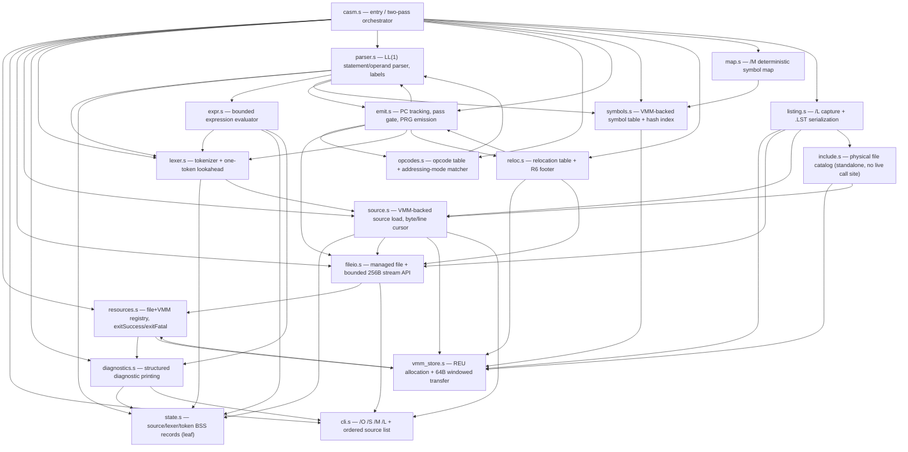
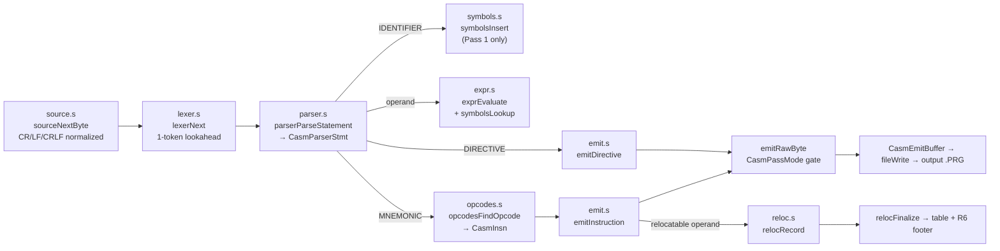

# CASM Programmer's Reference

CASM is command64's native 6502/6510 assembler: a ca65/ld65 external
application (`src/external/casm/`) that runs *on* the C64 and assembles
6502 source into a runnable PRG. This page documents its internal
architecture, module ABIs, data records, and diagnostic contract for anyone
extending CASM itself. For end-user command-line usage, see the (not yet
written) user manual; for the OS services CASM builds on, see
[api-reference.md](api-reference.md) and [programmers-reference.md](programmers-reference.md).

> **Status: Phase 10 and Phase 11 complete (build 1266, version 0.2.2).** `/M`
> (symbol map) and `/L` (listing file) are both fully wired into production
> `casm.s` and produce real output on every assembly that requests them —
> see [§17](#17-symbol-map--listing-output-phase-10-complete). WP55
> independently re-verified WP50-54's complete implementation (baseline
> reconciliation, full-path code review, live harness/identity/bounds/
> failure-injection verification, a 4-session runtime walkthrough) before
> the user approved the completion-only `0.1.56` -> `0.2.0` promotion.
> Phase 11 (WP56-61) followed with base-release hardening and
> certification — exhaustive opcode/addressing-mode/boundary verification
> and a proven determinism guarantee — with no new language feature and
> only one incidental production change (WP60's `CLD` hardening at
> `start:`), closing at `0.2.2` build `1266`.
> CASM performs a real two-pass assembly with labels, a bounded expression
> evaluator, a VMM-backed symbol table, up to eight concatenated top-level
> source files, native R6-relocatable output, a fully wired `.INCLUDE`
> dispatch (WP47), and a deterministic symbol map / source listing (WP50-54)
> — see [Coverage](#18-coverage-what-works-today). `.INCLUDE` is not merely
> built and fixture-tested: `casmRunPass` dispatches it for real, and DASH's
> production build (`CASM DMAIN.S /O:DASH.PRG`) exercises this path on every
> assembly — see [§16](#16-include-processing-phase-9-complete). See
> [wiki/tasks/casm.md](tasks/casm.md) for the live task list. Treat anything
> marked "not yet implemented" below as exactly that, not as a documentation
> gap.

## 1. Architecture

CASM is a layered pipeline, not a monolith. Each module is a separate ca65
translation unit linked together; dependencies point strictly downward
(`casm.s` orchestrates everything; `state.s` depends on nothing).


```mermaid
flowchart TD
    casm["casm.s — entry / two-pass orchestrator"]
    resources["resources.s — file+VMM registry, exitSuccess/exitFatal"]
    cli["cli.s — /O /S /M /L + ordered source list"]
    fileio["fileio.s — managed file + bounded 256B stream API"]
    vmm["vmm_store.s — REU allocation + 64B windowed transfer"]
    source["source.s — VMM-backed source load, byte/line cursor"]
    lexer["lexer.s — tokenizer + one-token lookahead"]
    parser["parser.s — LL(1) statement/operand parser, labels"]
    expr["expr.s — bounded expression evaluator"]
    symbols["symbols.s — VMM-backed symbol table + hash index"]
    opcodes["opcodes.s — opcode table + addressing-mode matcher"]
    reloc["reloc.s — relocation table + R6 footer"]
    include["include.s — physical file catalog (standalone, no live call site)"]
    diagnostics["diagnostics.s — structured diagnostic printing"]
    emit["emit.s — PC tracking, pass gate, PRG emission"]
    state["state.s — source/lexer/token BSS records (leaf)"]
    map["map.s — /M deterministic symbol map"]
    listing["listing.s — /L capture + .LST serialization"]

    casm --> resources & cli & fileio & source & diagnostics & lexer & parser & opcodes & emit & symbols & reloc & map & listing
    include --> vmm & source
    emit --> parser & opcodes & fileio & lexer & reloc
    map --> symbols
    listing --> vmm & fileio & source & include
    parser --> lexer & state & expr & symbols & emit
    expr --> lexer & state & diagnostics
    symbols --> vmm
    reloc --> vmm & fileio & emit
    source --> state & fileio & vmm & cli
    fileio --> resources & cli
    lexer --> state & source
    opcodes --> parser
    vmm --> resources
    resources --> diagnostics & vmm
    diagnostics --> state & cli
```

Runtime data flow per source statement:


```mermaid
flowchart LR
    src["source.s<br/>sourceNextByte<br/>CR/LF/CRLF normalized"] --> lex["lexer.s<br/>lexerNext<br/>1-token lookahead"]
    lex --> par["parser.s<br/>parserParseStatement<br/>→ CasmParserStmt"]
    par -->|IDENTIFIER| sym["symbols.s<br/>symbolsInsert<br/>(Pass 1 only)"]
    par -->|operand| ev["expr.s<br/>exprEvaluate<br/>+ symbolsLookup"]
    par -->|MNEMONIC| ops["opcodes.s<br/>opcodesFindOpcode<br/>→ CasmInsn"]
    par -->|DIRECTIVE| emitd["emit.s<br/>emitDirective"]
    ops --> emiti["emit.s<br/>emitInstruction"]
    emiti --> gate["emitRawByte<br/>CasmPassMode gate"]
    emitd --> gate
    emiti -->|relocatable operand| rel["reloc.s<br/>relocRecord"]
    gate --> out["CasmEmitBuffer → fileWrite → output .PRG"]
    rel --> foot["relocFinalize → table + R6 footer"]
```

`casm.s: start` runs this sequence: `CLD → diagClearLoc → listingStateInit →
listingFileInit → resourcesInit → cliInit → fileIoInit → sourceInit →
cliParse → cliDeriveOutputName → (/L: cliDeriveListingName) → symbolsInit →
sourceLoad → sourceOpen → lexerInit`, then two passes of the shared
`casmRunPass` dispatch. `CLD` (WP60 Increment 3) is the literal first
instruction of `start:`, hardening entry against decimal-mode leakage
independent of `OS_API` call ordering — CASM has no supported decimal-mode
entry contract, so this is a structural invariant, not a fix for a live
bug. `listingStateInit`/`listingFileInit` run before
`resourcesInit` specifically (WP54, deviating from Phase 10's original plan
wording) — both are pure BSS clears that cannot fail, and running them first
guarantees the unified `artifactsAbort` fatal path can safely inspect listing
state from the very first fatal exit onward.

- **Pass 1** (`CASM_PASS_MODE_MEASURE`): `emitInit`, then `casmRunPass`.
  No output file exists yet — `emitRawByte` no-ops in measure mode — so the
  pass only measures addresses and defines labels. Its final `CasmPc` is
  snapshotted into `CasmPass1FinalPc`.
- **Pass 2** (`CASM_PASS_MODE_EMIT`): `sourceRewind → includeReplayReset →
  (/L: listingCaptureInit) → lexerInit → fileCreateOutput → relocInit →
  emitInit`, then `casmRunPass` for real, now that every label resolves.
  Then, in order: `includeReplayFinalCheck → emitCheckPassAgreement → (/L:
  listingCaptureFinalize) → emitFinalize → relocFinalize → sourceClose →
  outputCommit → (/L: listingWriteFile) → (/M: diagClearLoc + mapPrint) →
  diagPrintPhase2Ready → exitSuccess`. The PRG is always committed
  (`outputCommit`) before any requested `/L` listing or `/M` map work, so a
  later listing/map failure can never cost an already-valid PRG — see
  [§17](#17-symbol-map--listing-output-phase-10-complete).

Every `bcs` after an init or pipeline call routes to `exitFatal` (via
`outputAbort` once an output file exists) — see
[§4](#4-resource-ownership--exit-contract).

`casmRunPass` dispatches each parsed statement by type: `IDENTIFIER` inserts
a symbol (Pass 1 only), `MNEMONIC` goes through `opcodesFindOpcode` +
`emitInstruction`, `DIRECTIVE` goes to `emitDirective`, `NEWLINE` does
nothing, and `EOF` ends the pass. The one exception is `.INCLUDE`, which
`casmRunPass` intercepts *before* `emitDirective` and dispatches directly:
includes alter the token source, so they are the driver's business, not the
emitter's. Pass 1 resolves it through `includeCatalogLoad` (real file I/O
allowed on a catalog miss); Pass 2 replays the identical result through
`includeCatalogLookup`, a separate entry point structurally incapable of
touching the filesystem — see [§16](#16-include-processing-phase-9-complete).

## 2. Build & Toolchain

- Built with ca65/ld65 via the `add_ca65_app` CMake helper (`src/external/AGENTS.md`), not KickAssembler.
- Entry file: `casm.s`. Shared declarations: `common.inc`. Includes
  `include/ca65/command64.inc` for OS API/KERNAL symbols and
  `build_casm.inc` (CMake-generated) for `BUILD_NUMBER`.
- Current `MAIN` link envelope: `$4000`, raised repeatedly as phases landed
  (`$1000` → `$2000` → `$2800` → … → `$3A00` → `$3E00` → `$4000`); every
  raise is a recorded, user-approved step in `wiki/tasks/casm.md`.
- Zero page: application-private range `$70-$8F` (32 bytes), declared once in
  `common.inc` and shared across translation units via `.exportzp`/`.importzp`
  where cross-file sharing is needed (`external/AGENTS.md` §Local Contracts).
- Version banner: `CASM V<major>.<minor>.<stage>.<build>`, defined in
  `casm.s` (currently `0.2.2`).

## 3. Zero-Page Contract (`common.inc`)

| Range | Alias(es) | Purpose |
|---|---|---|
| `$70-$77` | `CasmPtr0Lo/Hi`, `CasmPtr1Lo/Hi`, `CasmValue0Lo/Hi`, `CasmValue1Lo/Hi` | General pointers/values |
| `$78-$7F` | `CasmIoPtrLo/Hi`, `CasmIoLenLo/Hi`, `CasmVmmSegHi`, `CasmVmmBank`, `CasmVmmOffLo/Hi` | I/O and VMM transfer scratch |
| `$80-$83` | `CasmParseScratch0-3` — aliased per-phase as `CasmCliPos/TokenStart/DestIndex/Scratch` (CLI) and `CasmSourceScratch0/1` + `CasmLexerScratch0/1` (source/lexer) | Transient parser/lexer scratch, never persistent across a public routine boundary |
| `$84-$87` | `CasmExprScratch0-3` | Expression/opcode-matcher scratch (used by `opcodes.s` as `ofResolvedMode`/`ofMaskLo`/`ofMaskHi`/`ofScratch`, and by the diagnostic renderer as `CasmDiagWinStart/WinCount/CaretPos/WinFlags`) |
| `$88-$8F` | `CasmPassScratch0-3`, `CasmEmitScratch0-3` | Pass/emission scratch (used by `emit.s` for relative-branch math, and by the diagnostic renderer as `CasmDiagViewSel/ViewLen/ViewClipped`) |

All 32 bytes are asserted (`CASM_ZP_SIZE = 32`) so a boundary change fails
the build loudly. Nothing here persists across an `OS_API` call — CASM state
that must survive lives in BSS instead.

Two overlay decisions are load-bearing rather than incidental. The diagnostic
renderer overlays the *expression* scratch because it runs only on the
terminal fatal path, after all evaluation has stopped — and deliberately not
the lexer scratch, which `printDec16` clobbers. And
`CasmValue0Lo`/`CasmValue0Hi` are `vwPrepareTransfer`'s own documented
scratch: **never stash a value there across a `vmmWindowRead`/`vmmWindowWrite`
call**. That exact aliasing bug has been hit repeatedly during CASM's
development (`vmm_store.s` three times, then again in Phase 7's
`sourceAppendFile`).

## 4. Resource Ownership & Exit Contract (`resources.s`)

Every file handle CASM opens and every VMM allocation it takes is registered
with a central owner immediately after the OS call succeeds. This makes
`exitFatal` a single safe unwind path from anywhere in the pipeline, at the
cost of every call site checking `bcs` and jumping there.

| Routine | Purpose | Success | Failure |
|---|---|---|---|
| `resourcesInit` | Zero all ownership state and both registries (8 file + 8 VMM slots) | `C` clear | — |
| `resourceRegisterHandle` | Claim a file-registry slot for a handle just opened | `C` clear, `X` = slot 0-7 | `C` set, `A = CASM_DIAG_REGISTRY_FULL` |
| `resourceReleaseHandle` | Free a slot after its handle is closed | `C` clear | `C` set, `A = CASM_DIAG_UNKNOWN` (bad slot) |
| `resourceRegisterVmm` / `resourceReleaseVmm` | Same pattern for the VMM registry | mirrors above | mirrors above |
| `resourcesCleanup` | Best-effort, **repeat-safe** close of every owned file and free of every owned VMM allocation (guarded by `CasmCleanupGuard` against re-entry) | `C` clear | `C` set, `A = CASM_DIAG_CLEANUP_FAILED` if any close failed — the record stays owned so a later call retries it |
| `exitSuccess` | Clear last diagnostic, run `resourcesCleanup`, `DOS_EXIT` | does not return | prints a fatal message first if cleanup failed |
| `exitFatal` | `A` = primary diagnostic → print it, run `resourcesCleanup` (which cannot overwrite the primary), `DOS_EXIT` | does not return | — |

File records are `(flag, handle)` pairs (2 bytes × 8 slots); VMM records are
`(flag, seghi, bank, pages)` quads (4 bytes × 8 slots). The `pages` field is
the *granted* 4KB-page count (1-16) and exists because the OS provides no
capacity check of its own — `vmmWindowRead`/`vmmWindowWrite` bounds-check
every transfer against it. A failed close is left `OWNED` (not `FREE`)
specifically so a subsequent cleanup pass can retry it — this is what makes
`resourcesCleanup` safe to call twice.

Modules that own VMM storage (`source.s`, `symbols.s`, `reloc.s`) register no
cleanup owner of their own: the registry sweep already frees every registered
slot regardless of which module allocated it.

## 5. Command Line (`cli.s`)

Syntax: `CASM <source>… [/O:<output>] [/S] [/M] [/L]`. Source tokens and
options may appear in any order; `CommandBuffer` (the OS-owned 80-byte
buffer) is read but never modified.

| Option | Meaning | Status |
|---|---|---|
| *(bare filename)* | Source file — **1 to 8** of them (`CASM_SOURCE_COUNT_MAX`), concatenated in command-line order | implemented |
| `/O:<name>` | Explicit output filename (≤63 chars) | implemented |
| `/S` | Static output: the assembly must supply its own `.ORG`, and the PRG carries no relocation trailer | implemented |
| `/M` | Map file: prints the deterministic symbol map (`mapPrint`, `map.s`) after the PRG (and any `/L` listing) is committed | implemented (WP52 module, WP54 wiring) |
| `/L` | Listing file: derives a `.LST` name (`cliDeriveListingName`), captures Pass 2's traversal, and serializes the frozen 40-column listing format (`listingWriteFile`, `listing.s`) after the PRG is committed | implemented (WP51/WP53 modules, WP54 wiring) |

See [§17](#17-symbol-map--listing-output-phase-10-complete) for the map/listing output formats and module internals.

Option letters are matched case-insensitively (`AND #$5F` before comparison);
filename bytes are copied verbatim, never case-folded. Duplicate options and
unknown `/X` options are rejected (`CASM_DIAG_DUPLICATE_OPTION` /
`CASM_DIAG_UNKNOWN_OPTION`).

**Multi-file inputs.** Accepted source names land in an ordered array
(`CasmSourceNames`, 8 × 64 bytes, with `CasmSourceLens`/`CasmSourceCount`).
`cliCopySource` addresses the target slot through a compile-time
lookup table (`cliSourceSlotLo`/`cliSourceSlotHi`) rather than a runtime
multiply, because `CASM_FILENAME_BUFFER_SIZE` (64) does not divide 256
evenly. That table is exported and reused verbatim by `source.s`'s
`sourceLoad` and by the diagnostic renderer's `IN FILE` line, so no module
duplicates slot arithmetic.

**Output name derivation** (`cliDeriveOutputName`, used when `/O` is absent):
read **slot 0** (the first source name), tracking the last `.` seen *after*
the last `:` (device-prefix colons reset the tracked dot, so `8:foo.bar`
treats `.bar` as the extension, not anything before the colon). If a dot was
found, truncate there and append `PRG`; otherwise append `.PRG`. Both cases
bounds-check against `CASM_FILENAME_MAX` (63) and fail with
`CASM_DIAG_FILENAME_TOO_LONG` rather than silently truncating.

## 6. File & Stream Services (`fileio.s`)

Wraps `DOS_OPEN_FILE`/`DOS_READ_FILE`/`DOS_WRITE_FILE`/`DOS_CLOSE_FILE`/
`DOS_DELETE_FILE` with registration and EOF normalization.

| Routine | Purpose |
|---|---|
| `fileOpenInput` / `fileCreateOutput` | Open (read) / create (write) a handle and register it in one step; a registration failure closes the just-opened handle to avoid an orphan |
| `fileRead` | Bounded read; a zero-length result (regardless of carry) normalizes to `CASM_STREAM_EOF` rather than being treated as an error |
| `fileWrite` | Bounded write; a short write (actual ≠ requested count) is treated as failure (`CASM_DIAG_OUTPUT_SHORT_WRITE`) even though the OS call itself reported success |
| `fileClose` | Close, then release the registry slot **only if** the OS close succeeded |
| `fileDelete` | Delete by name (no registration involved) |
| `inputStreamOpen/Read/ReadInto/Close` | The managed-input convenience layer `source.s` builds on; the consumed-byte total is a checked 16-bit counter that fails with `CASM_DIAG_SOURCE_OFFSET_OVERFLOW` past 65,535 bytes — note this counter is **per file**, so the combined multi-file cap is enforced separately by `sourceLoad` ([§8](#8-source-stream-layer-sources)) |
| `outputAbort` | Best-effort close + delete of a partial output on a fatal path, preserving whichever diagnostic came first (primary) over any secondary cleanup failure |

`CasmIoBuffer` (256 bytes) is the single input transfer buffer, shared
between byte mode (whole buffer = transfer region) and line mode (see
[§8](#8-source-stream-layer-sources)).

## 7. VMM Storage Layer (`vmm_store.s`)

The REU-backed store every large CASM table lives in. It wires
`DOS_ALLOC_MEM`/`DOS_FREE_MEM`/`DOS_VMM_READ`/`DOS_VMM_WRITE` behind the
central registry and owns no registry storage of its own: a slot's
`SegHi`/`Bank`/`Pages` identity lives in `resources.s`'s `CasmVmmRegistry`
and is read here by slot index.

| Routine | Contract |
|---|---|
| `vmmStoreAlloc` | `X`/`Y` = byte count → `C` clear, `X` = registry slot. A **zero** count is rejected locally, before any OS call — that is what makes a later `VMM_ERR_INVALID` trustworthy as "no REU / not initialized" (`CASM_DIAG_VMM_UNAVAILABLE`) rather than "zero-paragraph request" |
| `vmmStoreFree` | Free by slot and release the registry record |
| `vmmWindowRead` / `vmmWindowWrite` | Transfer up to `CASM_VMM_BUFFER_SIZE` (64) bytes between `CasmVmmBuffer` and offset `CasmVmmOff*` of a slot, bounds-checked against that slot's granted `pages × 4096` |
| `vmmReplay` | Re-transfer helper used by the fixture harnesses |

Two frozen limits shape every consumer: a single allocation can address at
most 65,536 bytes (`CASM_VMM_ALLOC_MAX_BYTES` — a fixed `SegHi:Bank` pair
plus a 16-bit offset cannot reach further), and every transfer stages through
the *one* shared 64-byte `CasmVmmBuffer`. Because that buffer is shared, a
consumer must copy anything it still needs out of it before issuing the next
transfer — see the scratch warning in [§3](#3-zero-page-contract-commoninc).

`CASM_VMM_BUFFER_SIZE` is 64 rather than a rounder number because
`CASM_SYMBOL_REC_SIZE` is 64: one symbol record is exactly one transfer.

## 8. Source Stream Layer (`source.s`)

Sits between the managed file wrapper and the lexer. Owns loading, newline
normalization, line/column provenance, and a deterministic rewind — none of
which the raw file layer knows about.

**`sourceLoad` — the VMM pre-pass.** Before any traversal, `sourceLoad`
streams every parsed input file into **one** VMM allocation, in
command-line order: each file is opened through the Phase 2 wrapper, read in
256-byte `CasmIoBuffer` blocks, and written into the allocation through
64-byte `vmmWindowWrite` chunks. Consequences that matter downstream:

- `sourceOpen` and `sourceRewind` perform **no OS call at all** — both simply
  reset the traversal cursor to offset 0 of the loaded content. A rewind is
  therefore byte-, newline-, and location-identical to the first traversal by
  construction, not by re-reading the disk.
- `sourceRefill` fills `CasmIoBuffer` from VMM, not from disk.
- Each file's *start* offset is recorded in `CasmSourceFileTable`; a file's
  end is implicitly the next file's start (or the total length, for the
  last), so no length field is stored.
- Between files — never after the last — one synthetic LF is inserted if the
  preceding file did not already end with a newline.
- The combined 65,535-byte cap is checked explicitly by `sourceLoad`, because
  `inputStreamRead`'s own counter resets per file.

**File boundaries during traversal.** `srCheckFileBoundary` runs at the top
of each refill: when the read cursor lands exactly on the next file's
recorded start, `CasmSourceFileId` increments and line, column, and the
pending-CR latch all reset. Line numbers are therefore **per file**, and a
file ending in a bare CR can never phantom-collapse with the next file's
leading LF. A single equality test suffices because each refill's transfer is
capped at the next boundary (a 3-way `min`), so the cursor always lands
exactly on it. With one source file the whole mechanism degrades to a no-op.

**Traversal semantics** (unchanged since Phase 3):

- **Newline normalization**: `sourceNextByte` collapses CR, LF, and CRLF
  (including a CRLF split across a 256-byte block boundary, via a persistent
  "pending CR" latch) into one `CASM_SOURCE_NEWLINE` result. A raw byte comes
  back as `CASM_SOURCE_BYTE` in `CasmSourceResultByte`, which is **never**
  inferred from `A`/`Z` — a `0x00` source byte is a legal `BYTE` result, not
  end-of-line.
- **Location tracking**: one-based `CasmSourceLine{Lo,Hi}` and
  `CasmSourceColumn` (8-bit) advance per byte/newline, each with an explicit
  overflow check (`CASM_DIAG_SOURCE_LOCATION_OVERFLOW`) rather than silent
  wraparound.
- **Byte vs. line mode**: `sourceNextByte` and `sourceNextLine` are mutually
  exclusive per stream (`CasmSourceApiMode`). Line mode may only be claimed
  on a fresh, unconsumed stream; switching requires `sourceRewind`. Line mode
  partitions `CasmIoBuffer` — `[0..lineLength-1]` is the accumulated payload,
  `[lineLength..255]` is the live refill region — so a logical line survives
  a block boundary without a second buffer.
- **EOF is repeat-stable**: calling `sourceNextByte`/`sourceNextLine` again
  after EOF returns EOF again with no further OS call.
- **`sourceRewind`** does **not** invalidate the lexer's lookahead — that's
  the lexer's job (`lexerInit`), because lookahead is lexer state that
  `source.s` never writes. (Frame push and pop are the exception: they clear
  `CasmLookaheadValid` directly, since the state-owning caller is the one that
  knows the lookahead is now stale.)

**Byte provenance** (`state.s`): `CasmSourceResultFileId`/`LineLo`/`LineHi`/
`Column` record where the byte just delivered actually came from, written
inside `sourceFetchPhysical` at the one point that runs after any refill,
frame pop or file transition this fetch triggered, but before the byte's own
column/line advance. Consumers — `lexerFill` above all — must read these
**after** calling `sourceNextByte`, never snapshot `CasmSourceFileId`/`Line*`/
`Column` before the call: that call may be the one that resolves a child
frame's EOF and pops, in which case the byte returned belongs to the restored
parent.

**Frame stack** (`sourceFramePush`, [§16](#16-include-processing-phase-9-complete)):
`source.s` can suspend the current traversal and switch to another span of the
combined store, then resume exactly where it left off. Depth 0 means no nested
frame is active, i.e. traversal behaves exactly as it did before Phase 9.

Two invariants inside this module are easy to get wrong and have each already
caused a real defect:

- `CasmSourceVmmCursorLo/Hi` is the **bulk-refill read head, not the parse
  position**. A refill installs up to 256 bytes at once, so for any file
  smaller than the buffer the cursor already sits at that file's end while the
  lexer is still parsing its middle. The parse position is
  `cursor − (blockLen − blockIndex)`; anything asking "where is the parser
  right now" must apply that correction.
- Depth-0 traversal is bounded by `CasmSourceTopLevelEndLo/Hi`, a fixed
  snapshot taken when `sourceLoad` completes — **not** by
  `CasmSourceLoadedLenLo/Hi`, which keeps growing as `sourceAppendFile`
  appends content mid-traversal. Nested frames use their own
  `CasmFrameEndOffsetLo/Hi`.

**`sourceAppendFile`** streams one further file onto the end of the combined
store *during* traversal, without disturbing the live read cursor, and
reports its start offset and length. It shares the per-file streaming
primitive with `sourceLoad` through `CasmSourceStreamCursorLo/Hi`; the two
callers never run concurrently, so one shared cursor field is sufficient.

## 9. Lexer (`lexer.s`)

One-token lookahead over the normalized byte stream. `lexerNext` skips
whitespace and `;`-comments (but still emits the newline that terminates a
comment) and classifies the next significant token into the persistent
`CasmTokenRecord` (`state.s`).

**Token types** (`CASM_TOKEN_*`, $00-$0F):
`EOF, NEWLINE, IDENTIFIER, MNEMONIC, DIRECTIVE, REGISTER, NUMBER, COMMA,
COLON, HASH, LPAREN, RPAREN, PLUS, MINUS, LESS, GREATER`.

Scanning rules:

| Lead byte | Result |
|---|---|
| `,` `:` `#` `(` `)` `+` `-` `<` `>` | Single-byte punctuation token, direct table lookup (`lexerPunctBytes`/`lexerPunctTypes`) |
| `.` | `DIRECTIVE`; text matched case-insensitively against `.ORG .BYTE .WORD .INCLUDE .STATIC .RELOC`, else subtype `CASM_DIRECTIVE_UNKNOWN` (still a valid token — rejected later by the parser/emitter) |
| `$` | `NUMBER`, subtype `HEX`; at least one hex digit required |
| `%` | `NUMBER`, subtype `BINARY`; at least one `0`/`1` required |
| `0-9` | `NUMBER`, subtype `DECIMAL` |
| `A-Z a-z _` (shifted PETSCII accepted and folded) | Identifier scan, then reclassified: exactly one char matching `A`/`X`/`Y` → `REGISTER`; else a case-insensitive 3-letter match against the 56-entry `mnemonicTable` → `MNEMONIC` (subtype = table index 0-55); else `IDENTIFIER` |
| anything else | `CASM_DIAG_INVALID_SOURCE_BYTE` |

Token text is bounded to 31 payload bytes (`CASM_TOKEN_TEXT_MAX`);
overflowing it is `CASM_DIAG_TOKEN_TOO_LONG`, not truncation. A malformed
number (e.g. `$` followed by a non-hex-digit, or a numeric literal
immediately followed by an identifier character) consumes the rest of the
run and reports `CASM_DIAG_MALFORMED_NUMBER`.

**`CasmTokenRecord` layout** (39 bytes total, in `state.s`):

| Offset | Field | Size |
|---|---|---|
| 0 | Type (`CASM_TOKEN_*`) | 1 |
| 1 | Subtype (directive/register/number/mnemonic index, or `CASM_SUBTYPE_NONE`) | 1 |
| 2 | Length (text payload length) | 1 |
| 3 | FileId | 1 |
| 4-5 | Line (lo/hi) | 2 |
| 6 | Column | 1 |
| 7-38 | Text (`CasmTokenText`, 31 payload bytes + null terminator) | 32 |

An identifier's 31-byte bound is also the symbol table's name bound
([§12](#12-symbol-table-symbolss)) — the two are the same limit, not two
limits that happen to agree.

**`lexerScanIncludeOperand`** is a second, deliberately separate entry point
used only for a `.INCLUDE` operand, because an include filename (up to 63
bytes) does not fit the frozen 31-byte token payload. It scans the quoted
string following an already-consumed `.INCLUDE` directive into
`parser.s`'s own `CasmIncludeFilename` buffer, leaves the stable token record
untouched, and leaves the statement terminator buffered so ordinary statement
iteration is unaffected. The grammar it enforces:

| Rule | Failure |
|---|---|
| A `"` must open the operand | `CASM_DIAG_INCLUDE_FILENAME_EXPECTED` |
| 1-63 payload bytes, each printable PETSCII (`$20-$7E` or `$A0-$FE`); the quote itself is the delimiter and never payload | `CASM_DIAG_INVALID_INCLUDE_FILENAME` (empty or non-printable) |
| A closing `"` within 63 bytes | `CASM_DIAG_INCLUDE_FILENAME_TOO_LONG` |
| Only the statement terminator may follow | `CASM_DIAG_EXPECTED_NEWLINE` |

Payload bytes are stored in their **original** PETSCII spelling — no case
folding — because the spelling is what a diagnostic must echo back. Identity
comparison folds case at compare time instead ([§16](#16-include-processing-phase-9-complete)).

## 10. Parser (`parser.s`)

An LL(1) statement/operand parser consuming the lexer's single-token buffer
directly (no separate token stream materialized). Populates the persistent
7-byte `CasmParserStmt` record consumed by `opcodes.s` and `emit.s`. It is a
pure grammar module: it never inserts a symbol and never emits a byte.

Grammar (informal EBNF; `.BYTE`/`.WORD` operand lists are read by `emit.s`,
not this grammar — the parser stops after classifying the directive):

```
statement      := NEWLINE | EOF
                 | IDENTIFIER ':'                          ; label definition
                 | (MNEMONIC | DIRECTIVE) operandSeq
operandSeq     := terminator                              ; implied
                 | '#' expr terminator                      ; immediate
                 | expr [',' ('X'|'Y')] terminator           ; absolute/zp[,X/Y]
                 | 'A' terminator                            ; accumulator
                 | '(' expr ')' [',' 'Y'] terminator          ; indirect / (zp),Y
                 | '(' expr ',' 'X' ')' terminator             ; (zp,X)
expr           := ['<' | '>'] (NUMBER | IDENTIFIER) [('+'|'-') NUMBER]
terminator     := NEWLINE | EOF
```

**Label definitions** (`ppsLabel`): a statement beginning with `IDENTIFIER`
must be followed by `COLON`. The name is copied into `CasmLabelName`/
`CasmLabelNameLen` **before** the `lexerNext` that consumes the colon, since
`lexerNext` overwrites `CasmTokenText` unconditionally. The statement is
reported as type `CASM_TOKEN_IDENTIFIER`; defining the symbol is the
driver's job (`casm.s`'s `crpLabel`, Pass 1 only), keeping the semantic
action out of the grammar module. Any other unexpected token is
`CASM_DIAG_SYNTAX_ERROR`; a well-formed operand sequence missing its
terminator is `CASM_DIAG_EXPECTED_NEWLINE`.

**`.INCLUDE`** is classified like any other directive, then routed to
`lexerScanIncludeOperand` instead of the operand grammar above. The scanned
filename lands in this module's `CasmIncludeFilename` (64 bytes) /
`CasmIncludeFilenameLen`, kept here rather than in the token record because
63 bytes do not fit the frozen 31-byte payload. The parser validates and
stores; it performs no file, VMM, PC or output effect of any kind
([§16](#16-include-processing-phase-9-complete)).

**`CasmParserStmt` layout** (7 bytes, in `parser.s`'s own BSS):

| Offset | Field | Meaning |
|---|---|---|
| 0 | Type | `CASM_TOKEN_MNEMONIC`/`DIRECTIVE`/`IDENTIFIER`/`NEWLINE`/`EOF` |
| 1 | Subtype | Mnemonic index (0-55) or directive id |
| 2 | OpKind | `CASM_OPKIND_*` — the parser's coarse operand shape (see below) |
| 3-4 | ValLo/ValHi | Resolved 16-bit operand value |
| 5 | RegSubtype | `CASM_REGISTER_A/X/Y` when the operand named a register |
| 6 | Flags | `FORCE_ABS` (bit 0), `RELOCATABLE` (bit 1) |

`OpKind` (`CASM_OPKIND_*`) is deliberately coarser than the final 6502
addressing mode — e.g. `ABSOLUTE` covers both zero-page and absolute; it's
`opcodes.s` that resolves the concrete mode against operand size and the
mnemonic's supported-mode mask. Values: `IMPLIED, ACCUMULATOR, IMMEDIATE,
ABSOLUTE, ABSOLUTE_X, ABSOLUTE_Y, INDIRECT, INDEXED_INDIRECT,
INDIRECT_INDEXED`.

**`parserParseExpressionValue`** is the bridge to [§11](#11-expression-evaluator-exprs).
It binds `symbolsLookup` as the production resolver, is pass-mode-aware, and
derives the two statement flags:

- **`FORCE_ABS`** comes from the expression's `SYMBOL_DERIVED` flag — set the
  moment *any* resolver call succeeds, resolved or not — and deliberately
  **not** from the expression's own `FORCE_ABS` flag (which is set only on
  the unresolved path). Any symbol-derived operand forces absolute width
  unconditionally; otherwise a resolved backward reference under `$100` could
  choose zero-page width in Pass 2 where the unresolved forward reference
  chose absolute in Pass 1, shifting every following address.
- **`RELOCATABLE`** is derived the same unconditional way from the
  expression's `RELOCATABLE` flag. Before evaluating, this routine also calls
  `emitMarkStarted` (skipped for `.ORG`'s own operand) so the
  static-vs-relocatable mode is already committed when the classification
  happens.
- **Pass awareness**: under `CASM_PASS_MODE_MEASURE` an unresolved identifier
  is tolerated (a zero placeholder is stored and never emitted); under
  `CASM_PASS_MODE_EMIT` it is a hard `CASM_DIAG_UNDEFINED_SYMBOL`.

## 11. Expression Evaluator (`expr.s`)

A bounded, non-recursive evaluator — not a general expression compiler. One
expression is: an optional `<`/`>` extraction prefix, one primary (a numeric
literal or one identifier resolved through a caller-supplied callback), and
an optional `± NUMBER` addend. Anything else is
`CASM_DIAG_EXPR_MALFORMED`/`CASM_DIAG_EXPR_UNSUPPORTED`; arithmetic that
leaves 16 bits is `CASM_DIAG_EXPR_OVERFLOW`.

`exprEvaluate` takes the resolver's address in `X`/`Y` and the whole-assembly
relocatable-mode flag in `A`, and leaves the following token current on
return. The resolver ABI is a 5-byte output view
(`flags, idLo, idHi, valLo, valHi`) filled while the current token is still
`IDENTIFIER`; `symbolsLookup`'s calling convention was designed to match it
exactly, so no adapter exists.

**`CasmExprResult` layout** (9 bytes):

| Offset | Field | Meaning |
|---|---|---|
| 0-1 | ValLo/ValHi | Evaluated 16-bit value (meaningful when `RESOLVED`) |
| 2 | Flags | `RESOLVED` \| `SYMBOL_DERIVED` \| `RELOCATABLE` \| `FORCE_ABS` |
| 3 | Extraction | `FULL` / `LO` (`<`) / `HI` (`>`) |
| 4-5 | SymbolId | Resolver-reported identity |
| 6-8 | AddendSign, AddendMagLo/Hi | The parsed `±` addend, before application |

Numeric conversion (`exprParseNumeric`) uses a **24-bit accumulator with a
sticky overflow flag** — decimal ×10+digit, hex ×16+digit, binary ×2+digit.
The extra byte plus the sticky flag catch a value exceeding 65,535
*regardless of how many further digits follow*, rather than only checking the
final result. Overflow reports `CASM_DIAG_OPERAND_OUT_OF_RANGE`.

## 12. Symbol Table (`symbols.s`)

VMM-backed records plus a bounded RAM hash index over them.
`symbolsInit` makes exactly one `vmmStoreAlloc` call (512 × 64 = 32,768
bytes) and keeps that slot for the process lifetime.

| Routine | Contract |
|---|---|
| `symbolsInit` | Allocate the record store, clear all 128 bucket heads to `$FFFF` |
| `symbolsInsert` | `A` = name length, `CasmPtr0` = name, `X`/`Y` = value → define. An exact case-sensitive duplicate is `CASM_DIAG_DUPLICATE_SYMBOL`; a full table is `CASM_DIAG_SYMBOL_TABLE_FULL` |
| `symbolsLookup` | The `exprEvaluate` resolver: fills the 5-byte resolver view, reporting `RESOLVED` only for a `DEFINED` record |

**Record layout** (64 bytes, `CASM_SYMBOL_REC_*`): `NameLen` (1),
`Name` (31-byte fixed slot), `Val` (2), `Flags` (1, bit 0 = `DEFINED`),
`Next` (2, collision-chain record index, `$FFFF` = end), then 27 reserved
padding bytes zero-filled on every write. The record is padded from its
meaningful 37 bytes to 64 for two concrete reasons: it then fits
`CASM_VMM_BUFFER_SIZE` exactly (one record = one transfer), and
record-index → VMM-offset becomes a 16-bit shift-left-by-6 instead of a
multiply by 37.

Capacity is 512 records over 128 buckets; the bucket index is masked with
`$7F`, so no division is needed. Chains are walked with cheap early-outs
(length, then bytes) and the walk cursor lives in this module's own BSS —
never in `CasmValue0Lo/Hi`, which the VMM transfer path clobbers.

Symbol identifiers are **case-sensitive**: in PETSCII terms, unshifted and
shifted spellings of the same letter are different bytes and therefore
different symbols.

## 13. Opcode Table & Addressing-Mode Matcher (`opcodes.s`)

A pure function of `CasmParserStmt`: no I/O, no program-counter tracking, no
byte emission. `opcodesFindOpcode` resolves the parser's coarse `OpKind` to
one of 13 concrete `CASM_MODE_*` values, verifies the mnemonic actually
supports that mode, and fills the 3-byte `CasmInsn` record.

Resolution rules:

| Parser OpKind | Resolved mode |
|---|---|
| `IMPLIED` / `ACCUMULATOR` / `INDIRECT` | unchanged (1:1) |
| `IMMEDIATE` / `INDEXED_INDIRECT` / `INDIRECT_INDEXED` | unchanged, but requires `ValHi == 0` (`CASM_DIAG_OPERAND_OUT_OF_RANGE` otherwise) |
| `ABSOLUTE` | `RELATIVE` if the mnemonic's mask supports it (i.e. it's a branch — 16-bit target, no 8-bit check, displacement/range validated later in `emit.s`); else `ZEROPAGE` if `ValHi == 0`, `FORCE_ABS` is clear, **and** the mnemonic supports `ZEROPAGE`; else `ABSOLUTE` |
| `ABSOLUTE_X` | `ZEROPAGE_X` if `ValHi == 0`, `FORCE_ABS` clear, and supported, else `ABSOLUTE_X` |
| `ABSOLUTE_Y` | `ZEROPAGE_Y` if `ValHi == 0`, `FORCE_ABS` clear, and supported (mask bit lives in the high mask byte), else `ABSOLUTE_Y` |

The `FORCE_ABS` condition is what keeps instruction sizes identical between
the two passes — see [§10](#10-parser-parsers).

Each of the 56 mnemonics has a 13-bit "supported modes" bitmask
(`opcodeMaskLo`/`opcodeMaskHi`, bit position = `CASM_MODE_*` value) and a
start offset into a packed 151-entry `opcodeBytes` table
(`opcodeRunOffset`). Once the concrete mode is confirmed supported, the
opcode is found by counting how many of the mnemonic's *other* supported
mode bits sit below the resolved mode's bit — that count is the index into
its packed run. This is a purely mechanical scheme; extending it to an
unimplemented mnemonic means adding one mask/offset entry and its opcode
bytes in mode-bit order, not writing new matching logic.

**`CasmInsn` layout** (3 bytes): `Opcode` (selected byte), `Mode`
(`CASM_MODE_*`), `Length` (1-3, from a `CASM_MODE_COUNT`-entry
`modeLength` table).

Failure modes: `CASM_DIAG_INVALID_ADDR_MODE` (mode not in the mnemonic's
mask — e.g. `INX #5`) or `CASM_DIAG_OPERAND_OUT_OF_RANGE` (8-bit-only mode
given a 16-bit value).

## 14. Emission Engine (`emit.s`)

`emit.s` owns the program counter, the origin/relocatable-mode decision, the
pass gate, and the output staging buffer.

- **The pass gate is a single point.** `emitRawByte` checks `CasmPassMode`
  and writes nothing under `CASM_PASS_MODE_MEASURE`. Everything above it —
  dispatch, operand encoding, PC arithmetic, `.BYTE`/`.WORD` list reading —
  runs identically in both passes. That one gate is why Pass 1 can safely run
  the full pipeline before an output file even exists.
- **Origin and mode.** `emitInit` primes `CasmPc` to `CASM_DEFAULT_ORIGIN`
  (`$3400`) each pass, or to `$0000` under `/S`. The first statement that
  produces or locates output calls `emitMarkStarted`, which either commits
  the implicit default origin (writing the 2-byte PRG load-address header and
  setting `CasmRelocatableMode = 1`) or, under `/S` with no `.ORG` yet,
  fails with `CASM_DIAG_ORG_REQUIRED`. An explicit `.ORG` instead sets
  `CasmPc` from its operand, writes the header itself, and clears
  `CasmRelocatableMode` — static. A `.ORG` arriving *after* output has
  already started (a genuine second `.ORG`, or one after an implicit default
  origin) is `CASM_DIAG_DUPLICATE_ORG`.
- **`emitInstruction`** writes the opcode then 0-2 operand bytes per
  `CasmInsn.Length`/`Mode`. `CASM_MODE_RELATIVE` is the one non-literal
  case: it computes `displacement = target − (CasmPc + 1)` (the `+1`
  accounts for the opcode byte already having advanced `CasmPc`) and
  rejects anything outside `-128..+127` with
  `CASM_DIAG_BRANCH_OUT_OF_RANGE` — a check that needs the current PC, not
  just the operand's raw size, which is why it lives here and not in the
  opcode matcher.
- **Relocation hooks.** Immediately before writing a byte that may need
  relocating, `emitMaybeRecordLo`/`emitMaybeRecordHi` call `relocRecord`
  ([§15](#15-relocation--r6-output-relocs)) while `CasmPc` still equals that
  byte's address. They fire only when the statement's `RELOCATABLE` flag is
  set, and use `ValHi`'s own zero/nonzero state to tell a genuine full
  16-bit value (record the high byte) from an explicit `>`-extracted value
  (record the low byte). Length-2 modes record only `IMMEDIATE`; zero-page
  and the indirect pointer forms are deliberately excluded.
- **`emitByteList`/`emitWordList`** implement `.BYTE`/`.WORD` by reading a
  comma-separated expression list directly off the lexer (the parser
  deliberately stopped after classifying the directive — see
  [§10](#10-parser-parsers)); at least one value is required, and `.BYTE`
  values must fit 8 bits (`CASM_DIAG_OPERAND_OUT_OF_RANGE` otherwise).
- **Output staging**: bytes accumulate in a 64-byte `CasmEmitBuffer`
  (`CASM_EMIT_BUFFER_SIZE`), separate from the 256-byte `CasmIoBuffer`
  input buffer because both are live simultaneously during a pass.
  `emitRawByte` flushes via `fileWrite` when the buffer fills;
  `emitFinalize` flushes whatever remains.
- **`emitCheckPassAgreement`** compares the final `CasmPc` against
  `CasmPass1FinalPc`. A genuine disagreement is not believed reachable under
  the current grammar (`FORCE_ABS` makes every symbol-derived operand the
  same width in both passes, and branches never consult it) — this is a
  defensive internal invariant, reported as the locationless
  `CASM_DIAG_PASS_MISMATCH`.
- **`.STATIC` / `.RELOC`** are recognized by the lexer as directives but
  rejected by `emitDirective` with `CASM_DIAG_NOT_IMPLEMENTED` — they're
  lexed, not yet assembled. Note that static-vs-relocatable output is
  selected by `/S` and the presence of `.ORG`, not by these directives.
  **`.INCLUDE`** never reaches `emitDirective` at all: `casmRunPass`
  intercepts it first, so the emitter treats it as an internal dispatch
  error (`CASM_DIAG_UNKNOWN`) rather than unsupported syntax.

## 15. Relocation & R6 Output (`reloc.s`)

A flat, VMM-backed, append-only list of 16-bit little-endian code offsets
(`CasmPc − CASM_DEFAULT_ORIGIN`), capped at `CASM_RELOC_MAX` = 4096 entries
(8,192 bytes, one VMM allocation). It is allocated once per Pass 2,
*unconditionally* — a static assembly simply never appends an entry, and the
unused allocation costs REU space rather than `MAIN` envelope.

| Routine | Contract |
|---|---|
| `relocInit` | One `vmmStoreAlloc`, entry count = 0. Called once, before Pass 2 emission |
| `relocRecord` | Append the current `CasmPc` offset. No-ops under `CASM_PASS_MODE_MEASURE` (the table does not exist during Pass 1); `CASM_DIAG_RELOC_TABLE_FULL` at capacity |
| `relocFinalize` | After `emitFinalize`, append the table then the 6-byte footer. No-ops (C clear) when `CasmRelocatableMode` is 0 |

Entries are written immediately, one `vmmWindowWrite` per call, never staged
across calls: `CasmVmmBuffer` is also used transiently by `symbolsLookup`
between a statement's operands, so holding state in it across calls would
reproduce the shared-scratch clobber bug class this codebase has already hit
several times.

The footer is `CASM_DEFAULT_ORIGIN` (2), entry count (2), then the ASCII
magic `R6` — little-endian, byte-identical to `tools/reloc.py`'s layout. The
table is copied back out in ≤64-byte chunks (`vmmWindowRead` → `fileWrite`,
no staging across chunks) and the footer is staged in the same now-free
buffer for one final write. No seeking is involved: `emitFinalize` already
left the file position immediately after the last program byte.

## 16. Include Processing (Phase 9, complete)

**`.INCLUDE` is fully wired and reachable from a real assembly.** WP47 wired
the pieces below (previously built, frozen and fixture-tested standalone in
`tests/src/casm_include`, `casm_catalog`, `casm_frame`) into `casmRunPass`'s
real dispatch: Pass 1 resolves each `.INCLUDE` through
`includeCatalogLoad` (which may perform real file I/O on a catalog miss),
and Pass 2 replays the identical result through `includeCatalogLookup` — a
separate entry point that is structurally incapable of filesystem I/O, so a
second pass can never diverge from what Pass 1 already loaded. DASH's
production build (`CASM DMAIN.S /O:DASH.PRG`, seven source files chained
through one `.INCLUDE` from `dmain.s`) exercises this path on every real
assembly. The phase contract (Phase 0C.19, in
`brain/plans/2026-07-25-casm-phase9-include-processing.md`) freezes: quoted
1-63-byte raw-PETSCII filenames, inherited parent devices unless explicitly
prefixed, immutable Pass 1 loading with filesystem-free Pass 2 replay, 16
include levels, 32 physical files, 128 include events, and the existing
65,535-byte combined source cap.

### 16.1 Physical file catalog (`include.s`)

One 8KB VMM allocation: the first 4,096 bytes hold 32 × 128-byte physical
records; the remaining 4,096 are reserved, untouched space for WP47's
include-event log — deliberately not a second allocation.

| Routine | Contract |
|---|---|
| `includeCatalogInit` | Allocate the metadata store, catalog empty |
| `includeResolveDevice` | `A` = parent's resolved device, `X`/`Y` = spelling → resolved device (8-11) and a pointer past any `<n>:` prefix |
| `includeCatalogFind` | Linear scan for a captured key; `C` clear + `X` = record index on a hit |
| `includeCatalogRead` | Read record `A` into `CasmIncludeRecordStage` (two 64-byte windows) |
| `includeCatalogLoad` | Resolve → deduplicate → on a miss, transiently open/read/close the child through `sourceAppendFile` and write a new record. `C` clear + `X` = record index |

**Record layout** (128 bytes, `CASM_INCLUDE_PHYS_REC_*`): `Flag`, `Device`,
`NameLen`, one reserved byte, `Start` (2, offset in the combined source
store), `Length` (2), a 64-byte null-terminated `Name` slot, then 56 reserved
bytes. 128 = exactly two `CASM_VMM_BUFFER_SIZE` transfers, the same
one-record-per-transfer discipline `CASM_SYMBOL_REC_SIZE` established.

Three design points carry their own rationale:

- **Device resolution reuses the OS's `DOS_PARSE_PREFIX`** rather than
  scanning for a colon locally. That routine already advances the caller's
  pointer past a recognized `8:`/`9:`/`10:`/`11:` prefix in place, and a
  naive local scan would disagree with it on a name like `FOO:BAR`, where the
  OS finds no prefix but a colon is still present. When no prefix is given,
  the OS would resolve to `CurrentDevice` — which is *not* what a child
  should inherit, so the parent's own resolved device is substituted instead.
- **Identity folds case at compare time** (`includeFoldByte`) instead of
  storing a second folded copy: unshifted and shifted PETSCII spellings
  compare equal, while only the original spelling is ever persisted, so one
  buffer satisfies both the case-insensitive identity rule and the
  original-spelling-for-diagnostics rule.
- **A repeated include loads nothing.** On a catalog hit there is no file
  I/O and no append: every include of the same physical file shares one
  immutable byte copy in the source store.

A linear scan is sufficient at 32 records (with cheap early-outs on flag,
device, name length, then folded bytes) — unlike the 512-entry symbol table,
no hash index is warranted. A 33rd distinct file is
`CASM_DIAG_INCLUDE_CATALOG_FULL`.

### 16.2 Frame stack and nested traversal (`source.s`)

`sourceFramePush` suspends the current traversal and switches to a child's
span of the combined store; `CASM_INCLUDE_MAX_DEPTH` is 16 levels beyond the
depth-0 root. The frame stack is plain BSS parallel arrays indexed by
depth − 1: the child's catalog index and end offset, plus the parent's exact
resume state (offset, line, column, pending-CR latch).

- **Inputs**: `A` = candidate catalog index, `CasmValue0Lo/Hi` = child start,
  `CasmValue1Lo/Hi` = child end. Both must be staged immediately before the
  call — `CasmValue0Lo/Hi` is VMM transfer scratch and cannot survive an
  intervening transfer.
- **Checks run before any state change**, so a rejected push leaves the frame
  stack, the live cursor and the echo buffers completely untouched: depth at
  the cap is `CASM_DIAG_INCLUDE_DEPTH_EXCEEDED`, and a candidate already
  present in the **active frame chain** is `CASM_DIAG_INCLUDE_CYCLE_DETECTED`.
  Cycle detection scans the active chain only — a diamond (the same file
  included twice along different branches) is legal and dedupes; only genuine
  recursion is rejected.
- **Push** saves the parent's state, switches the cursor to the child's start
  at line 1 / column 1, invalidates the installed block and the lexer's
  lookahead, and increments the depth.
- **Pop is automatic.** When a refill computes a zero-length transfer,
  `srEofOrPop` either reports EOF (depth 0) or restores the parent frame and
  re-enters `sourceRefill` from the top — which may immediately pop again, as
  happens when an included file's very last statement was itself an
  `.INCLUDE`. Popping restores only previously saved state, so it cannot fail.

Note that `sourceFramePush` takes the child's start and length as plain
inputs and has **no** dependency on `include.s`; the caller resolves the child
through `includeCatalogLoad` first. The layering stays one-way — `include.s`
imports from `source.s`, never the reverse.

## 17. Symbol Map & Listing Output (Phase 10, complete)

`/M` and `/L` are both fully wired into production `casm.s` as of WP54; the
underlying modules (`map.s` WP52, `listing.s` WP50/WP51/WP53) were built and
fixture-tested in earlier increments with no live call site, then wired into
the real `start`/`casmRunPass` sequence by WP54 (see [§1](#1-architecture)).
Neither module owns any resource the other's abort path doesn't already know
how to release — see [§4](#4-resource-ownership--exit-contract)'s
`artifactsAbort`.

### 17.1 Symbol map (`/M`, `map.s`)

One exported routine, `mapPrint`, walks symbol records in **definition
(insertion) order** via `symbolsReadByIndex` — deliberately never
`CasmSymbolBuckets` hash-chain order, so the same source always prints the
same map regardless of hash placement. Output is a header, one `$HHHH LABEL`
row per symbol (uppercase hex address, then the symbol's own PETSCII
spelling), and a final `NNN SYMBOLS` total. `mapPrint` owns no VMM/file/
source resource itself — `symbolsReadByIndex` is its only VMM access, through
the symbol table's already-registered slot — and formats each row into its
own private buffer (`CasmMapRowBuf`, 40 bytes: `"$HHHH "` + up to a 31-byte
name + CR + null) rather than reusing `diagnostics.s`'s character-at-a-time
hex/decimal printers, since a complete row must be built before printing.
Failure is `CASM_DIAG_SYMBOL_MAP_INVALID` (a corrupt record: bad `NameLen`,
`DEFINED` clear, reserved flag bits set, or nonzero reserved padding) or a
propagated `CASM_DIAG_VMM_TRANSFER_FAILED`; both are locationless.

### 17.2 Listing capture and `.LST` serialization (`/L`, `listing.s`)

Two independent lifecycles, both owned by `listing.s` and both initialized
unconditionally in `start` (WP54) so they are always safe BSS regardless of
whether `/L` was requested:

- **Capture** (`listingCaptureInit`/`listingCaptureFinalize`, active only
  between them, and only under `/L`): records one 16-byte metadata record
  per source line (`CASM_LISTING_META_REC_SIZE`; fields `FILEID`, `FLAGS`,
  `LINE`, source `OFF`/`LEN`, starting `PC`, and the emitted `BYTEOFF`/
  `BYTECOUNT` range) via `listingBeginLine`/`listingCommitLine`, plus a
  parallel byte-mirror of every emitted byte via `listingMirrorByte`, up to
  `CASM_LISTING_META_MAX` = 4096 records. Capture observes Pass 2's real
  traversal — it starts only after `sourceRewind`/`includeReplayReset` and
  ends before `emitFinalize`/`relocFinalize` touch the output file (see
  [§1](#1-architecture)). Overflow is `CASM_DIAG_LISTING_RECORDS_FULL` /
  `CASM_DIAG_LISTING_BYTES_FULL`; a capture-time transaction-discipline
  violation is `CASM_DIAG_LISTING_REPLAY_MISMATCH`.
- **File** (`listingFileInit`, always; `listingCreate`/`listingWriteFile`/
  `listingClose`/`listingDelete`/`listingAbort` under `/L`): owns the actual
  `.LST` CBM DOS handle, including the WP53 `@0:` replace-on-open marker
  (`cliDeriveListingName` derives the name from the output name, mirroring
  `cliDeriveOutputName`'s own extension-swap rule). `listingWriteFile` is the
  aggregate serializer: it replays every captured record
  (`listingReplayReset`/`listingReplayNext`), validates each one against the
  running expected byte offset (`listingValidateRecord`, which also resolves
  the record's owning filename via `listingResolveFilename` — including
  `.INCLUDE`d files, through `includeCatalogRead`), and formats the frozen
  40-column output: file headers with 31-byte name-chunk continuations,
  detail rows with independent byte- and source-continuations, uppercase
  hex, 5-digit zero-padded line numbers, and exact verbatim source bytes,
  buffered through the reused `CasmIoBuffer` with flush-before-split. A
  `listingValidateRecord` mismatch is the same
  `CASM_DIAG_LISTING_REPLAY_MISMATCH` diagnostic as a capture-time violation
  (the check is symmetric); file I/O failures are `CASM_DIAG_LISTING_
  CREATE_FAILED`/`WRITE_FAILED`/`CLOSE_FAILED`/`DELETE_FAILED`/
  `SHORT_WRITE`. `listingAbort` is a documented no-op when nothing was ever
  created and never deletes an already-committed listing.

  A record belonging to an included file resolves through
  `includeCatalogRead`, which — as its own header documents — overwrites
  `CasmVmmBuffer` as its own VMM transfer scratch. `listingValidateRecord`
  and `listingWriteFile`'s own record-snapshot both learned this the hard
  way (a real WP54 bug, fixed same-day): each now stashes the fields it
  still needs (`CasmListValidByteCountLo/Hi`; the `CasmListCurrentRecord`
  snapshot) *before* calling `listingResolveFilename`, not after.

### 17.3 Wiring order and artifact safety (`casm.s`, WP54)

`/M` and `/L` are independent CLI bits (`CASM_OPT_MAP`/`CASM_OPT_LIST`) and
may be combined. The completion order — deliberately fixed, not incidental —
is: PRG commit (`outputCommit`) **before** any listing write, and listing
write **before** the map print, so a later-stage failure never costs an
earlier one's already-valid artifact: a listing failure retains the
committed PRG and suppresses the map/success line; a map failure retains
the committed PRG and listing and suppresses only the success line. The
unified `artifactsAbort` (chains `listingAbort` then `outputAbort`, both
already independently safe against deleting a committed artifact) handles
every fatal exit uniformly, regardless of how far initialization got or
which options were active. See [§1](#1-architecture) for the full call
sequence and `brain/plans/2026-07-29-casm-phase10-wp54-production-integration.md`
for the increment-by-increment implementation record.

## 18. Coverage: What Works Today

As of build 1266 / v0.2.2 (Phase 9 complete; Phase 10 complete; Phase 11
complete):

**Works:**

- All 56 legal, documented 6502 mnemonics across every addressing mode they
  support (implied, accumulator, immediate, zero page [,X/,Y], absolute
  [,X/,Y], indirect, `(zp,X)`, `(zp),Y`, relative) — WP60 exhaustively
  certified all 151 legal opcode/addressing-mode combinations, not merely
  implemented, via an independent oracle, a direct matcher harness, and an
  end-to-end assembled artifact compared byte-for-byte against an
  independently-authored reference.
- `.ORG`, `.BYTE`, `.WORD` directives.
- **Labels and forward references** via a real two-pass assembly over a
  512-entry, VMM-backed symbol table.
- **Bounded expressions**: `<`/`>` extraction, one symbol or literal, and a
  `± NUMBER` addend.
- **Up to eight top-level source files**, concatenated in command-line order
  with per-file line numbers in diagnostics.
- **`.INCLUDE`**, fully wired into `casmRunPass` dispatch (WP47): quoted
  1-63-byte filenames, inherited parent device unless explicitly prefixed,
  up to 32 distinct physical files deduplicated by identity, 16 nesting
  levels, Pass 1 real I/O via `includeCatalogLoad` replayed filesystem-free
  in Pass 2 via `includeCatalogLookup` ([§16](#16-include-processing-phase-9-complete)).
  Exercised on every real DASH build, not just fixture-tested.
- **Two output modes**: static (`/S` plus an explicit `.ORG`) and, by
  default, R6-relocatable output at origin `$3400` with a relocation table
  and footer the OS's own loader understands.
- **`/M` (deterministic symbol map) and `/L` (source listing) output**,
  fully wired (WP54) into the real assembly pipeline — see
  [§17](#17-symbol-map--listing-output-phase-10-complete). Both may be
  combined; either, both, or neither may be requested per assembly.
- Full syntax/range/mode/branch-distance validation with a specific
  diagnostic per failure (66 distinct `CASM_DIAG_*` codes —
  [§19](#19-diagnostic-reference)).

**Not yet implemented** (each fails with a specific, non-silent diagnostic
rather than being silently accepted):

- **`.STATIC` / `.RELOC` directives** — `CASM_DIAG_NOT_IMPLEMENTED`; use
  `/S` and `.ORG` instead.
- **Combined sources over 64K** — `sourceLoad`'s checked total overflows at
  65,536 bytes (`CASM_DIAG_SOURCE_OFFSET_OVERFLOW`).
- **Multiplicative or parenthesized expression arithmetic** —
  `CASM_DIAG_EXPR_UNSUPPORTED`.
- **`fileCreateOutput` has no replace-on-exists marker** (pre-existing,
  Phase 2/WP13-era, unlike `listingCreate`'s WP53-era `@0:`-aware open):
  rerunning `casm` against an output name that already exists on disk hangs
  in a KERNAL IEC retry loop rather than replacing or failing fast. Use a
  distinct `/O:` name per run, or delete the stale output first. Tracked as
  a follow-up, not a WP54 regression.
- **`/L` listing output shows a blank line between each row when printed to
  a real C64 screen.** `.LST` file content on disk is unaffected — the
  extra blank line is a downstream KERNAL auto-wrap-plus-trailing-CR display
  artifact at the 40-column boundary, not a defect in `listing.s` itself.
  Non-critical, on-screen presentation only (Taskwarrior
  `be8ca0bf-ac7c-40f6-960e-2ca816bc7fb8`).
- **One-byte-source phantom-EOF-byte defect in `sourceLoad`/`sourceNextByte`.**
  A previously-suspected-but-unresolved defect independently reproduced
  during WP60 Increment 7; not fixed under WP60/WP61 and tracked separately
  (Taskwarrior UUID `882433f0-cde1-4849-8b3c-df32613518c3`).

**Determinism (WP61):** identical input is now proven to produce
byte-identical output. Re-assembling the same source twice produces the
same PRG bytes, the same R6 relocation table, and the same `.LST` listing
content, verified via a native `comp` self-compare; the `/M` symbol map
(which has no file to `comp`) was verified identical via direct live
comparison instead.

Bounded capacities worth knowing before writing large source: 512 symbols,
4,096 relocation entries, 31-byte identifiers, 8 source files, 64KB combined
source, 4,096 listing records per assembly (`/L`). Frozen for Phase 9, in
place but not yet exercised by a live assembly: 32 distinct included files,
16 nesting levels, 63-byte include filenames.

## 19. Diagnostic Reference

All diagnostics are stable one-byte identifiers (`CASM_DIAG_*`) with a fixed
PETSCII message, looked up via a parallel low/high address table in
`diagnostics.s` (`diagPrintFatal`). Ranges are contiguous per phase and
asserted at build time; `$00` (`NONE`) and `$FF`/out-of-range (`UNKNOWN` →
`"CASM: INTERNAL ERROR"`) are the only gaps.

The **Context** column marks the diagnostics that additionally print a
location line and a caret under the offending source (see §18.1). The rest
print the message line alone — they have no meaningful source position.

### 18.1 Source-context contract

A source-position diagnostic prints its location beneath its message; with
more than one top-level source, an `IN FILE` line precedes it:

```text
IN FILE MACROS.S
AT LINE 2, COL 9 (OFFSET 8) BYTE $40
  LDA #$0A@,X
          ^
```

`LINE`/`COL` are 1-based and **per file**; `OFFSET` is the 0-based byte index
(`COL - 1`). `BYTE` is emitted only for `INVALID_SOURCE_BYTE`. How this is
produced:

- **Location.** `diagnostics.s` holds a `CasmDiagLoc*` record. A raise site
  stamps it immediately before returning its diagnostic, via one of three
  helpers: `diagSetLocFromLookahead` (the pending byte, used for
  `INVALID_SOURCE_BYTE`, which also records the byte), `diagSetLocFromToken`
  (the current token — parser, lexer and expression sites), or
  `diagSetLocFromStmt` (the statement start — emit sites).
  `diagPrintSourceContext` self-gates on `CasmDiagLocValid`, so an unstamped
  diagnostic stays bare and a stale location never attaches to an unrelated
  failure.

- **Filename.** The stamped record carries `CasmDiagLocFileId`, which indexes
  `cli.s`'s exported `cliSourceSlotLo/Hi` table directly to get a
  ready-to-print name. The `IN FILE` line is emitted only when
  `CasmSourceCount > 1`, keeping single-file diagnostic text byte-identical
  to every earlier phase's.

- **Line text.** The lexer drives the source in byte mode, so `CasmIoBuffer`
  is a block window, not a line window, and cannot recover the line after a
  refill. `source.s` instead echoes each consumed line into a dedicated
  buffer (`diagLineAppend`). **Two** buffers are kept and swapped on each
  newline: the parser consumes a statement's terminating newline before
  `emit.s` runs, so an emit diagnostic's line is the *previous* one by then.
  `diagResolveView` matches the diagnostic's line against both and renders
  whichever holds it, or suppresses the line and caret if neither does.

- **Tail recovery.** The echo ends at the failing byte. For a current-line
  diagnostic the renderer first calls `sourceDrainLineTail`, which reads
  forward to the next newline to recover text right of the caret. It is
  **terminal and diagnostic-only**: it bypasses the source state gate (the
  source is already `ERROR`), maintains none of the traversal invariants, and
  never reports a diagnostic of its own — a failed read silently truncates
  the display rather than masking the primary diagnostic. It is safe solely
  on the fatal path, immediately before `resourcesCleanup`.

- **Sanitizing and windowing.** Bytes outside printable PETSCII render as `.`
  (required, not cosmetic: `INVALID_SOURCE_BYTE` fires on exactly such bytes,
  and echoing a raw `$93` would clear the screen). Lines wider than the
  38-column window slide to keep the caret visible, with `<.`/`.>` marking a
  clipped edge. The caret row is emitted separately so it never depends on the
  OS print routine's own wrapping.

The echo buffers cost 512 bytes of BSS. Design and rationale:
`brain/plans/2026-07-20-casm-diagnostic-source-context.md`.

| Code | Identifier | Message | Context | Raised by |
|---|---|---|---|---|
| `$01` | `INIT_FAILED` | INITIALIZATION FAILED |  | (reserved) |
| `$02` | `REGISTRY_FULL` | RESOURCE REGISTRY FULL |  | `resourceRegisterHandle`/`Vmm` |
| `$03` | `CLEANUP_FAILED` | RESOURCE CLEANUP FAILED |  | `resourcesCleanup` |
| `$04` | `SOURCE_REQUIRED` | SOURCE FILE REQUIRED |  | `cli.s` |
| `$05` | `EXTRA_SOURCE` | TOO MANY SOURCE FILES |  | `cli.s` (>8 sources) |
| `$06` | `MALFORMED_OUTPUT_OPTION` | MALFORMED /O OPTION |  | `cli.s` |
| `$07` | `DUPLICATE_OPTION` | DUPLICATE OPTION |  | `cli.s` |
| `$08` | `UNKNOWN_OPTION` | UNKNOWN OPTION |  | `cli.s` |
| `$09` | `FILENAME_TOO_LONG` | FILENAME TOO LONG |  | `cli.s` |
| `$0A` | `NOT_IMPLEMENTED` | FEATURE NOT IMPLEMENTED |  | `emit.s` (`.STATIC`/`.RELOC`) |
| `$0B` | `INPUT_OPEN_FAILED` | CANNOT OPEN INPUT |  | `fileio.s` |
| `$0C` | `INPUT_READ_FAILED` | INPUT READ FAILED |  | `fileio.s` |
| `$0D` | `INPUT_CLOSE_FAILED` | INPUT CLOSE FAILED |  | `fileio.s`/`source.s` |
| `$0E` | `OUTPUT_CREATE_FAILED` | CANNOT CREATE OUTPUT |  | `fileio.s` |
| `$0F` | `OUTPUT_WRITE_FAILED` | OUTPUT WRITE FAILED |  | `fileio.s`/`reloc.s` |
| `$10` | `OUTPUT_CLOSE_FAILED` | OUTPUT CLOSE FAILED |  | `fileio.s` |
| `$11` | `OUTPUT_DELETE_FAILED` | OUTPUT DELETE FAILED |  | `fileio.s` |
| `$12` | `OUTPUT_SHORT_WRITE` | SHORT OUTPUT WRITE |  | `fileio.s`/`reloc.s` |
| `$13` | `STREAM_STATE_FAILED` | INVALID STREAM STATE |  | `fileio.s`/`source.s` *(Phase 2 range ends here)* |
| `$14` | `SOURCE_REWIND_FAILED` | SOURCE REWIND FAILED |  | `source.s` |
| `$15` | `SOURCE_OFFSET_OVERFLOW` | SOURCE OFFSET OVERFLOW |  | `source.s` / `fileio.s` (>64K combined source) |
| `$16` | `SOURCE_LOCATION_OVERFLOW` | SOURCE LOCATION OVERFLOW |  | `source.s` (line/column overflow) |
| `$17` | `SOURCE_LINE_TOO_LONG` | SOURCE LINE TOO LONG | ✓ | `source.s` (line mode, >255 bytes) |
| `$18` | `TOKEN_TOO_LONG` | TOKEN TOO LONG | ✓ | `lexer.s` (>31 text bytes) |
| `$19` | `INVALID_SOURCE_BYTE` | INVALID SOURCE BYTE | ✓ | `lexer.s` / `source.s` (embedded null in line mode) |
| `$1A` | `MALFORMED_NUMBER` | MALFORMED NUMBER | ✓ | `lexer.s` |
| `$1B` | `LEXER_STATE_FAILED` | INVALID LEXER STATE |  | `lexer.s` *(Phase 3 range ends here)* |
| `$1C` | `SYNTAX_ERROR` | SYNTAX ERROR | ✓ | `parser.s` / `emit.s` (unknown or malformed directive) |
| `$1D` | `EXPECTED_NEWLINE` | EXPECTED NEWLINE | ✓ | `parser.s` |
| `$1E` | `OPERAND_OUT_OF_RANGE` | OPERAND OUT OF RANGE | ✓ | `parser.s`/`expr.s` (16-bit overflow), `opcodes.s` (8-bit modes), `emit.s` (`.BYTE` >255) |
| `$1F` | `INVALID_ADDR_MODE` | INVALID ADDRESSING MODE | ✓ | `opcodes.s` |
| `$20` | `DUPLICATE_ORG` | DUPLICATE ORG | ✓ | `emit.s` (second `.ORG`, or one after output started) |
| `$21` | `ORG_REQUIRED` | ORG REQUIRED | ✓ | `emit.s` (`/S` with no `.ORG`) |
| `$22` | `ADDRESS_OVERFLOW` | ADDRESS OVERFLOW |  | `emit.s` (`CasmPc` past `$FFFF`) |
| `$23` | `BRANCH_OUT_OF_RANGE` | BRANCH OUT OF RANGE | ✓ | `emit.s` (relative displacement outside ±127) *(Phase 4 range ends here)* |
| `$24` | `EXPR_MALFORMED` | MALFORMED EXPRESSION | ✓ | `expr.s` |
| `$25` | `EXPR_UNSUPPORTED` | EXPRESSION UNSUPPORTED | ✓ | `expr.s` |
| `$26` | `EXPR_OVERFLOW` | EXPRESSION OVERFLOW | ✓ | `expr.s` (checked add/sub) |
| `$27` | `RESOLVER_FAILED` | RESOLVER FAILED | ✓ | `expr.s` (resolver returned `C` set) *(Phase 5 range ends here)* |
| `$28` | `VMM_UNAVAILABLE` | VMM UNAVAILABLE |  | `vmm_store.s` (`VMM_ERR_INVALID`: no REU / not initialized) |
| `$29` | `VMM_ALLOC_FAILED` | VMM ALLOCATION FAILED |  | `vmm_store.s` (`VMM_ERR_NOMEM`, or a zero-size request) |
| `$2A` | `VMM_FREE_FAILED` | VMM FREE FAILED |  | `vmm_store.s` |
| `$2B` | `VMM_TRANSFER_FAILED` | VMM TRANSFER FAILED |  | `vmm_store.s` (windowed read/write) *(Phase 6A range ends here)* |
| `$2C` | `DUPLICATE_SYMBOL` | DUPLICATE SYMBOL | ✓ | `symbols.s` (name already `DEFINED`) |
| `$2D` | `UNDEFINED_SYMBOL` | UNDEFINED SYMBOL | ✓ | `parser.s` (unresolved identifier in Pass 2) |
| `$2E` | `SYMBOL_TABLE_FULL` | SYMBOL TABLE FULL | ✓ | `symbols.s` (512 records) |
| `$2F` | `PASS_MISMATCH` | PASS 1/2 MISMATCH |  | `emit.s` (`emitCheckPassAgreement`) *(Phase 6B range ends here)* |
| `$30` | `RELOC_TABLE_FULL` | RELOC TABLE FULL |  | `reloc.s` (4096 entries) *(Phase 8 range ends here)* |
| `$31` | `INCLUDE_FILENAME_EXPECTED` | INCLUDE FILENAME EXPECTED | ✓ | `lexer.s` (no opening quote after `.INCLUDE`) |
| `$32` | `INVALID_INCLUDE_FILENAME` | INVALID INCLUDE FILENAME | ✓ | `lexer.s` (empty or non-printable byte), `include.s` (empty post-prefix name) |
| `$33` | `INCLUDE_FILENAME_TOO_LONG` | INCLUDE FILENAME TOO LONG | ✓ | `lexer.s` (>63 payload bytes) *(WP44 range ends here)* |
| `$34` | `INCLUDE_CATALOG_FULL` | INCLUDE CATALOG FULL | ✓ | `include.s` (32 distinct physical files) *(WP45 range ends here)* |
| `$35` | `INCLUDE_DEPTH_EXCEEDED` | INCLUDE DEPTH EXCEEDED | ✓ | `source.s` (`sourceFramePush`, 16 levels) |
| `$36` | `INCLUDE_CYCLE_DETECTED` | INCLUDE CYCLE DETECTED | ✓ | `source.s` (candidate already in the active frame chain) *(WP46 range ends here)* |
| `$37` | `INCLUDE_EVENT_LOG_FULL` | INCLUDE EVENT LOG FULL |  | `include.s` (128 include events) |
| `$38` | `INCLUDE_REPLAY_MISMATCH` | INCLUDE REPLAY MISMATCH |  | `casm.s` (Pass 2's `includeCatalogLookup` disagrees with Pass 1's recorded result — defensive internal invariant) *(Phase 9/WP47 range ends here)* |
| `$39` | `LISTING_NAME_COLLISION` | LISTING NAME COLLISION | ✓ | `cli.s` (`cliDeriveListingName`: derived `.LST` name collides with the PRG output name) |
| `$3A` | `LISTING_RECORDS_FULL` | LISTING RECORDS FULL |  | `listing.s` (`listingCommitLine`: metadata store at `CASM_LISTING_META_MAX` = 4096) |
| `$3B` | `LISTING_BYTES_FULL` | LISTING BYTES FULL |  | `listing.s` (`listingMirrorByte`: byte mirror at capacity) |
| `$3C` | `LISTING_REPLAY_MISMATCH` | LISTING REPLAY MISMATCH |  | `listing.s` (capture/replay transaction discipline violated — same check fires from `listingCommitLine` at capture time and `listingValidateRecord` at serialization time) *(Phase 10/WP51 range ends here)* |
| `$3D` | `LISTING_CREATE_FAILED` | LISTING CREATE FAILED |  | `listing.s` (`listingCreate`) |
| `$3E` | `LISTING_WRITE_FAILED` | LISTING WRITE FAILED |  | `listing.s` (`listingWrite`/`listingWriteFile`) |
| `$3F` | `LISTING_CLOSE_FAILED` | LISTING CLOSE FAILED |  | `listing.s` (`listingClose`) |
| `$40` | `LISTING_DELETE_FAILED` | LISTING DELETE FAILED |  | `listing.s` (`listingDelete`/`listingAbort`) |
| `$41` | `LISTING_SHORT_WRITE` | LISTING SHORT WRITE |  | `listing.s` (`listingWrite`: actual byte count ≠ requested) *(Phase 10/WP53 range ends here)* |
| `$42` | `SYMBOL_MAP_INVALID` | SYMBOL MAP INVALID |  | `map.s` (`mapPrint`: corrupt symbol record — bad `NameLen`, `DEFINED` clear, reserved flag bits set, or nonzero reserved padding) *(Phase 10/WP52 range ends here)* |
| `$FF` | `UNKNOWN` | INTERNAL ERROR |  | fallback for `$00`/out-of-range values |

See [§17](#17-symbol-map--listing-output-phase-10-complete) for the map/
listing modules these diagnostics belong to.

## 20. Extending CASM

- **New directive**: add a `CASM_DIRECTIVE_*` constant and its name string in
  `lexer.s` (`dirOrgStr` etc. + the `compareTokenText` chain in
  `lnDirective`), bump `CASM_DIRECTIVE_COUNT`, then handle it in
  `emitDirective` (`emit.s`). If it takes a single operand rather than a
  comma-list, let `parser.s`'s existing grammar populate `CasmParserStmt`
  instead of adding it to the `.BYTE`/`.WORD` deferred-operand special case.
  Anything that emits bytes must call `emitMarkStarted` first, and must
  behave identically in both passes.
- **New mnemonic** (only if it's a legal, documented 6502 opcode variant —
  CASM does not target undocumented opcodes): add its 3-letter name to
  `mnemonicTable` in `lexer.s`, bump `CASM_MNEMONIC_COUNT`, and add one
  mask/offset entry plus its packed opcode bytes (in ascending
  `CASM_MODE_*` bit order) to `opcodeMaskLo/Hi`, `opcodeRunOffset`, and
  `opcodeBytes` in `opcodes.s`. No matcher logic changes — the bit-counting
  scheme in `ofSelectOpcode` is mnemonic-agnostic.
- **New diagnostic**: append to the end of the relevant phase's contiguous
  range in `common.inc` (`CASM_DIAG_PHASE{2,3,4,5,6A,6B,8}_LAST` markers
  exist specifically so this is a build-time-checked append, not a
  renumbering), add its message string and pointer-table entry in
  `diagnostics.s`, and update the `.assert` table-length checks.
- **New VMM-backed table**: allocate once through `vmmStoreAlloc` and keep
  the returned slot; register no cleanup owner (the registry sweep already
  frees it). Size records to a power of two so index → offset is a shift, and
  copy anything you still need out of `CasmVmmBuffer` before the next
  transfer.
- **Anything touching instruction width** must keep Pass 1 and Pass 2 in
  agreement — that is the single invariant `emitCheckPassAgreement` exists to
  defend, and the reason `FORCE_ABS` is derived from `SYMBOL_DERIVED` rather
  than from resolution state.
- Per `src/external/casm/AGENTS.md`, any work package from Phase 3 WP3
  onward needs an approved plan under `brain/plans/` *before* implementation
  starts — this isn't optional tooling advice, it's a hard gate the repo's
  agents enforce.

## Related

- [Codebase Knowledge Graph § 7](codebase-knowledge-graph.md#7-casm--internal-module-graph) — the same module graph in the context of the whole `src/`/`include/` tree.
- [wiki/tasks/casm.md](tasks/casm.md) — live phase/work-package status.
- `src/external/casm/AGENTS.md` — the local contracts and hard gates this module works under.
- `brain/plans/2026-07-*-casm-*.md` — approved phase and work-package plans (source of the numeric contracts documented above), including `2026-07-25-casm-phase9-include-processing.md` for the Phase 9 freeze.
- [api-reference.md](api-reference.md) — the `OS_API` (`JSR $1000`) surface CASM calls into for every file/print operation.
- [vmm-api.md](vmm-api.md) — the OS VMM services `vmm_store.s` wraps.
