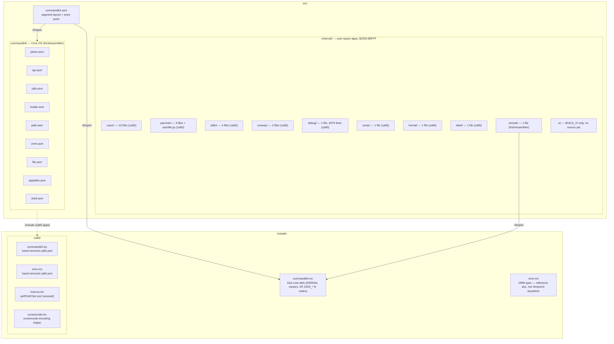
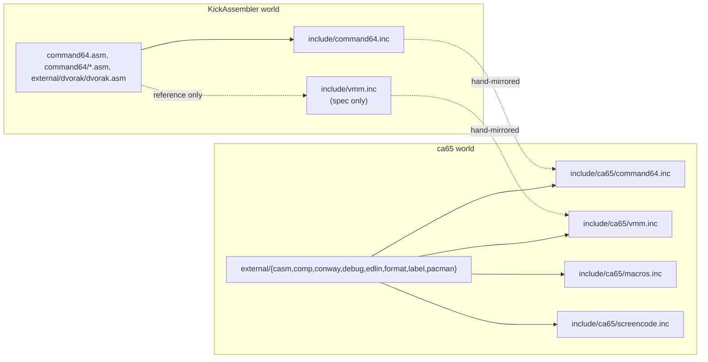
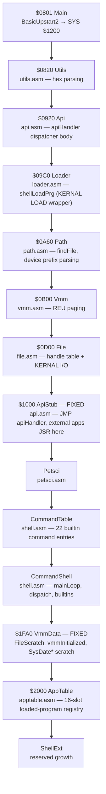
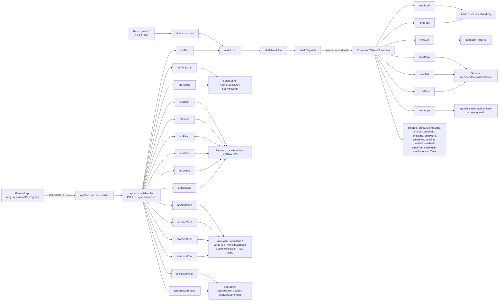
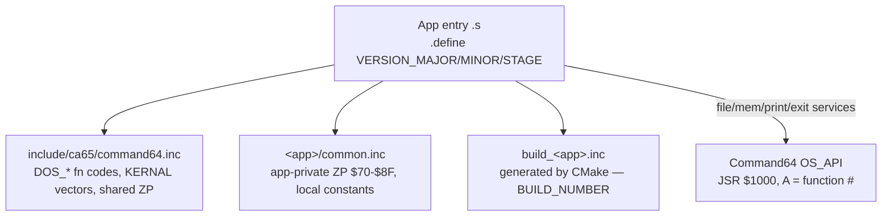
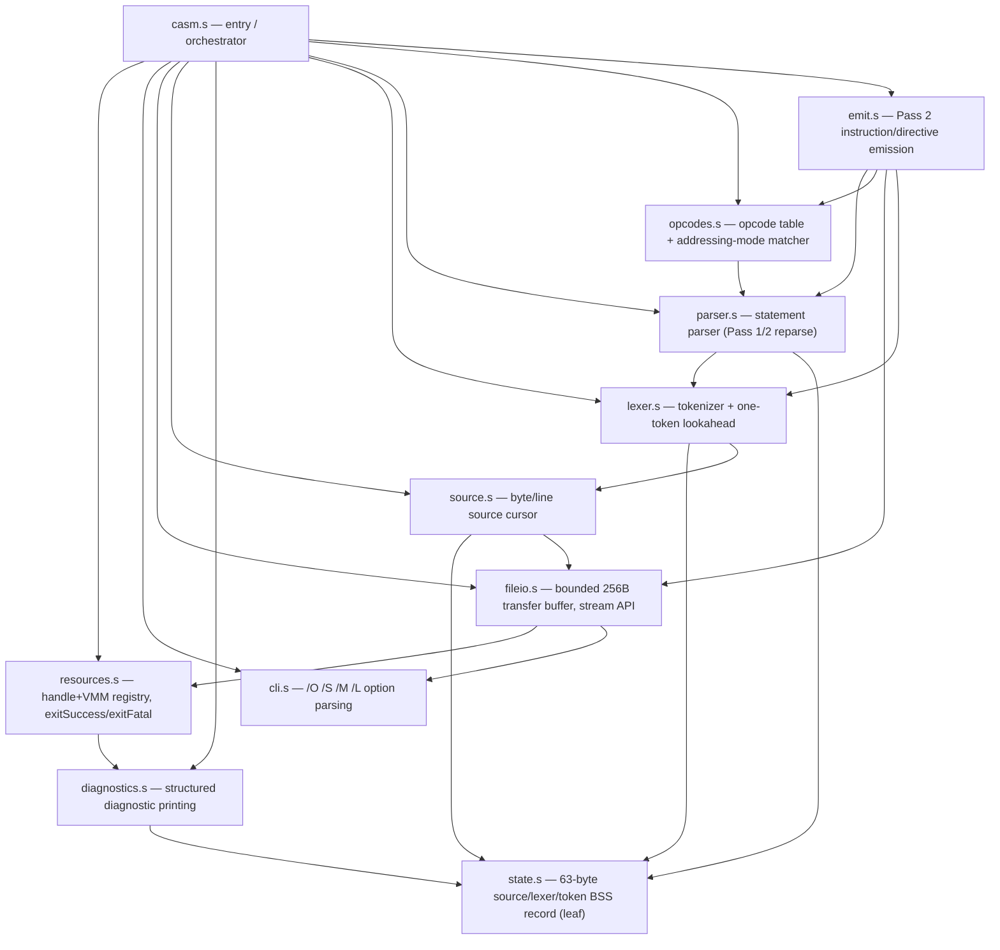

# Codebase Knowledge Graph (src/ + include/)

This page maps the structural and runtime relationships of the command64 OS
source tree. Scope is strictly [src/](../src/) and [include/](../include/) —
build tooling (`cmake/`, `tools/`), tests, and the wiki/brain/docs themselves
are out of scope. Diagrams were built by manually tracing `#import`/`.include`
directives and ca65 `.export`/`.import` symbol tables (the codebase-memory
MCP was unavailable for this pass); see individual `AGENTS.md` files linked
below for the authoritative contracts behind each subsystem.

## 1. Codebase Map

## 2. Toolchain Split & Header Mirroring

Two assemblers coexist by directory contract ([src/external/AGENTS.md](../src/external/AGENTS.md)):
Kick Assembler builds the core OS (and `dvorak`), ca65/ld65 builds every other
external app. Each toolchain has its own header set, kept in sync by hand
rather than shared.

## 3. Core OS Memory Segment Layout

`src/command64.asm` chains KickAssembler segments with `startAfter`, so
source-file order in `#import` determines final memory layout. `ApiStub` and
`VmmData` are pinned addresses that external apps and other core modules
hardcode; everything else floats. (Source: [command64.asm](../src/command64.asm) header comment.)

## 4. Core OS Runtime Call Graph

Two entry paths converge on the same subsystem modules: the interactive
shell loop (built-in commands) and the `OS_API` service bus that external
apps call via `JSR $1000` (documented in [wiki/api-reference.md](api-reference.md)).

## 5. External Application Skeleton

Every ca65 external app (all of `src/external/` except `dvorak`) follows the
same three-header pattern, then talks to the core OS exclusively through the
`OS_API` jump table — apps never touch core OS zero page or internals
directly ([src/external/AGENTS.md](../src/external/AGENTS.md)).

## 6. External Application Inventory

| App | Toolchain | Files | Multi-module? | Notes |
|---|---|---|---|---|
| `casm` | ca65/ld65 | 10 | Yes — layered (§7) | Native 6502 assembler; VMM-backed source/symbol storage |
| `pacman` | ca65/ld65 | 3 + `autotile.py` | Yes (§8) | Maze table generated by `autotile.py`, checked into `pacman_game.s` |
| `edlin` | ca65/ld65 | 4 | Yes (§8) | Port of MS-DOS EDLIN line editor |
| `conway` | ca65/ld65 | 2 | Yes (§8) | Game of Life demo |
| `debug` | ca65/ld65 | 1 (3479 lines) | No — monolithic | Interactive memory editor/monitor; no `common.inc` |
| `comp` | ca65/ld65 | 1 | No | Raw byte-stream file comparison |
| `format` | ca65/ld65 | 1 | No | Drives 1541 `N:` command via `DOS_SEND_COMMAND` |
| `label` | ca65/ld65 | 1 | No | Disk volume-label writer |
| `dvorak` | KickAssembler | 1 | No | Port of a BASIC type-in listing; only non-ca65 external app |
| `vi` | — | 0 | — | `BUILD_VI` placeholder only; no source implemented yet |

## 7. CASM — Internal Module Graph

CASM ([src/external/casm/AGENTS.md](../src/external/casm/AGENTS.md)) is the
only external app with a layered architecture, reconstructed here from its
`.export`/`.import` symbol tables. `state.s` is pure BSS storage (63 bytes,
no imports) sitting at the bottom; `casm.s` is the orchestrator at the top.

## 8. Pacman / Edlin / Conway — Internal Module Graphs

The remaining multi-file apps use a flat two-to-three module split (no
layering like CASM).

```mermaid
flowchart TD
    subgraph Pacman["pacman/"]
        pmain["pacman_main.s — game loop, entry"]
        pgame["pacman_game.s — maze render/collision (mazeWalls table)"]
        pai["pacman_ai.s — ghost AI, scatter/frightened modes"]
        pmain --> pgame
        pmain --> pai
        pai -->|"getWallCell"| pgame
    end

    subgraph Edlin["edlin/"]
        emain["edlin.s — command loop, EditBuf, line input"]
        ecmds["cmds.s — L/P/D/I/E/Q/W command handlers"]
        ebuf["buffer.s — windowed line buffer, gap (hole) management"]
        emain --> ebuf
        emain --> ecmds
        ecmds --> ebuf
        ecmds -->|"EditBuf, ownLineInput, Filename ptrs"| emain
    end

    subgraph Conway["conway/"]
        cmain["conway_main.s — sim loop, entry"]
        cgrid["conway_grid.s — grid state, rules, rendering"]
        cmain --> cgrid
    end
```

## Caveats & Method Notes

- `include/vmm.inc` (Kick side) is a specification document only — grepping
  the tree shows no `#import` of it anywhere; `vmm.asm` references it only in
  a comment. Its ca65 mirror `include/ca65/vmm.inc` is actually included by
  ca65 apps.
- `build_os.inc` and every `build_<app>.inc` are CMake-generated at build
  time (from the persistent `BUILD_<APPNAME>` counter files) and are not
  present in `src/` — they're referenced but don't exist as checked-in
  source.
- `src/external/vi/` contains only a `BUILD_VI` counter file; there is no
  source to graph yet.
- Diagrams reflect static `#import`/`.include`/`.export`/`.import` structure
  and direct `JSR`/`jmp` targets found by inspection, not a compiled linker
  map — cross-check against the linker output if precision at the byte level
  is required.
